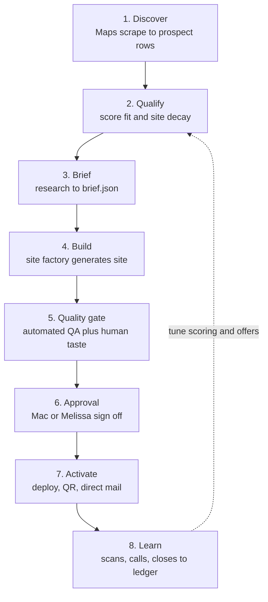

# Pipeline Spec

Mac's pipeline, stage by stage, with the honest status of each: automated, partly automated, or manual. This note is the answer to "whats the steps taken we can use to automate everything."

Mac's original chain:

> Bot scrape > database > AI site builder > Zapier > QR Code > Direct Mail > Gate Keep for Sales Call

Mapped against the Orbit eight-stage model (discover, qualify, diagnose, build, quality gate, human approval, activate, learn).



## Stage 1: Discover

**Goal:** a row per prospect with verified identity.

**Fields required:** business name, category/vertical, market, address, phone, website URL, Google Maps URL, review count, rating, place ID.

**Status: automated against the live 238 sheet.** Dillon's Google Sheet [Momentum 360 - 238 Call-Ready Businesses](https://docs.google.com/spreadsheets/d/1U6qB7EWRL7DRXMK46W7-KLhDYoVXV4Q-9rpC14qMTlo) is the database Jesse is calling from (`JESSE CALL SHEET` + `BUSINESSES`). Public-safe snapshot: `_os/automation/fixtures/prospects/jesse-238-call-ready.json` (238 rows, 71 with public email; phones and street addresses omitted). Loader: `_os/outreach-engine/lib/jesse-238.js`. Stable ids are `J238-001` … `J238-238`. Mac's Zapier column set is emitted as `zapier.csv` by the outreach engine.

The 238 sheet is that database today. New weekly batches still flow through OSM + radar; they merge here by domain.

**Guardrails:** dedupe by place ID; suppress existing Momentum clients (cross-check `01_Clients/`), current pipeline deals, and anyone previously mailed.

## Stage 2: Qualify

**Goal:** rank who's worth building for.

**Score inputs:**
- **Site decay** (Dillon's insight, 2026-07-12: businesses whose sites "look really old and outdated" are the best targets). Signals: no mobile viewport, table layouts, dated fonts/stock imagery, no HTTPS, slow load, copyright year 3+ years stale, no schema.
- **Local visibility gap:** ranks poorly relative to review count, unclaimed or unoptimized GBP
- **Ability to pay:** review volume and price point as proxies for revenue
- **Vertical fit:** does Momentum have an industry page and case studies here (see [[Market Roster]])
- **Ad presence:** already spending means already sold on marketing

**Status: automated.** Built 2026-08-06 — see [[Site Grader]] and the `/site-grade` skill.

`bin/grade-sites.js` takes prospect rows and emits two 0–100 scores with per-finding reasons: a **Site Quality Score** (how good their current site is) and an **Opportunity Score** (whether to spend a build slot). Discovery is automated too — `bin/discover-prospects.js` pulls candidates from OpenStreetMap and filters chains, social-only listings, and every domain we have already built for.

The scoring runs in tiers so a 500-row pull is affordable: Tier 0 is one HTTP fetch per candidate with no browser, Tier 1 renders only the candidates still undecided, Tier 2 adds a human taste verdict. An existing `harvest.json` is reused as free Tier 1 evidence.

**Crucially, this stage now answers Mac's 2026-08-05 objection** that some prospects already have really great websites. A strong site no longer scores as a good target — and it is not discarded either, it routes to an ads / local SEO / GBP offer instead. Graded against their own sites, only 9% of the completed 100 would qualify for a rebuild today, versus 18% of a fresh Philadelphia pull.

**To automate next:** feed ability-to-pay signals (review count, rating, ad presence, GBP status) from Mac's Maps sheet into the opportunity score. OSM carries none of them, which caps `opportunity_confidence` at 0.65 for discovered rows.

## Stage 3: Brief

**Goal:** a complete `brief.json` per prospect, written from a real harvest.

**Status: automated (agent-driven), documented.**

1. `node _templates/site-factory/harvest.js <slug> <site-url> [social-url ...]` (or `--from targets.json`) captures screenshots of the site and socials, downloads their imagery, and extracts copy, palette, fonts, contact facts, and decay signals into `harvest/<slug>/harvest.json`.
2. `/mirror-and-improve` mines their voice from that harvest, diagnoses what to beat via `/ux-audit`, then designs the upgrade via `/ui-design`, `/motion-design`, and `/frontend-build`.
3. Output is one `briefs/<slug>.json` hitting the canonical spec in `philly-sites/DESIGN-SYSTEM.md`: **10 sections, 350 to 500 words, 12 to 13 images**.

Contract and field reference: `_templates/site-factory/README.md`. Brand derivation starts from `brand.palette` and `brand.fonts` in the harvest, not from taste. Their nouns and taglines carry over verbatim; writing tightens under `System/writing-rules.md`.

**Guardrail:** every factual field needs a source. Unverifiable fields stay empty rather than invented. Drop any target whose harvest failed.

## Stage 4: Build

**Goal:** finished sites on disk.

**Status: automated.**

- Single site: `node _templates/site-factory/build-site.js <brief.json> <out-dir>`
- Whole batch: `node _templates/site-factory/build-batch.js <batch-dir>`

The batch runner builds every brief in a batch directory, then emits the review hub, the sheet-ready CSVs, and a batch report. Zero npm dependencies for the build itself.

**Tier A vs Tier B** (established by the 2026-07-17 pilots): Tier A is this shared-architecture batch, used for volume outreach. Tier B is a bespoke build with its own architecture and motion language, reserved for prospects who engage. Don't spend Tier B effort on cold volume.

## Stage 5: Quality gate

**Goal:** nothing embarrassing reaches a prospect.

**Status: automated, with a required human taste pass.**

`node _templates/site-factory/qa.js <site-dir> [--json]` enforces the ship checklist: JSON-LD parses, viewport and meta description present, every image has alt text and exists on disk, no empty CTA hrefs, required sections present, surface rhythm, and with Playwright, screenshots plus horizontal-overflow checks at 390/850/1440px.

Machine-readable result distinguishes `PASS` (static + visual), `STATIC_ONLY` (visual skipped), and `FAIL`. Static-only is **not** a full pass: `qa_ready` stays `hold`. Spec range misses (sections/words/images) are gate failures, not soft warnings. The batch runner fails closed on any of these.

Batch-level gates the runner also handles: duplicate-image detection across the batch (the "keep every photo unique" rule from the 2026-07-12 delivery) and a `noindex` audit.

**Human pass that can't be automated:** does this look expensive, does it look like the business, is the palette dull. Review the batch hub, not individual files.

The gate is evidence-backed: the maker supplies a hashed screen recording of
the batch walkthrough, and a different checker reviews it at desktop and mobile
before `qa_ready` can become ready. The evaluator rejects missing recordings,
self-review, incomplete viewport coverage, and any failed visual verdict.

## Stage 6: Human approval

**Goal:** Mac or Melissa signs off on the exact list and the exact mail piece.

**Status: manual by design. This is a hard gate, not a bottleneck to remove.**

Approval package per batch: one hub URL, a five-minute Loom, the prospect CSV, and the mail piece proof. Mac's stated preference is one link plus a short Loom.

Per the tier rules in `AGENTS.md` and the orchestrator spec, everything up to here is autonomous. Everything after is Tier 2.

## Stage 7: Activate

**Goal:** live URLs, QR codes, mail in hand.

**Sub-steps and status:**

| Step | Status | Notes |
|---|---|---|
| Deploy previews | Manual, scripted | 238 live noindex drafts already sit on the Netlify hub. HUD also serves the pack at `/outreach/<batch>/`. |
| Tracked URL per prospect | **Automated** | `qr_target_url` with UTM parameters per prospect. |
| QR code generation | **Automated locally** | `_os/outreach-engine/lib/qr.js` writes SVG per row. `qrtiger.csv` still feeds Mac's Zapier + QRTiger zap if he wants that path. |
| Mail merge | **Proof automated, send is not** | Print-ready 6×4 HTML in `mail/`. `postgrid.csv` + `zapier.csv` for the vendor zap. `mail_ready` always `hold` until `approve-batch.js`. Vendor still Mac's call (PostGrid or StackAdapt). |
| Gatekeep the call | **Automated** | `gate/<slug>/` landing: "we built this for you" → homepage → book-a-call form with prospect id. HUD `POST /api/outreach/book` logs the request and does not send. |

**To automate next:** Mac/Melissa approve a list, pick the mail vendor, drop `postgrid.csv` into the zap. No engineering blocker.

## Stage 8: Learn

**Goal:** the engine gets smarter every week.

**Status: automated.**

Per-batch ledger: `batches/<batch-id>/results.md` + `results.json`. Ingest:

```bash
node _os/outreach-engine/bin/record-results.js <batch-dir> --prospect J238-001 --event scan
```

Events: `scan`, `call_booked`, `mailed`, `closed`, `no_answer`, `not_interested`, `wrong_number`. Sliced by vertical. No PII.

This mirrors the Optimization Ledger hypothesis pattern from the orchestrator spec: every batch is a hypothesis with an expected outcome and a review date; wins become patterns, losses become documented mistakes.

## Automation scorecard

| Stage | Automated | Owner | Next action |
|---|---|---|---|
| 1 Discover | Yes | Jesse + Dillon | 238-row sheet is live; OSM/radar still feeds new weeks |
| 2 Qualify | Yes | Dillon | Feed Maps review/ad data into the opportunity score |
| 3 Brief | Yes (agent) | Dillon | None; runbook exists |
| 4 Build | Yes | Dillon | 238 already built; factory still runs new weeks |
| 5 Quality gate | Yes + human | Dillon | 238 QA passed 2026-08-13 |
| 6 Approval | Manual by design | Mac / Melissa | `approve-batch.js` is the only mail_ready flip |
| 7 Activate | Yes, send held | Dillon + Mac | QR + mail proof + gatekeep + Zapier CSVs shipped |
| 8 Learn | Yes | Dillon | Ledger + HUD booking log |

**Short answer for Mac:** one command now runs the whole chain on the 238 sheet Jesse already has. Sites are live. QR, mail proofs, and the sales-call gate are generated. Nothing mails until you or Melissa approve the exact list. Pick PostGrid or StackAdapt and the zap reads the CSV this already emits.
