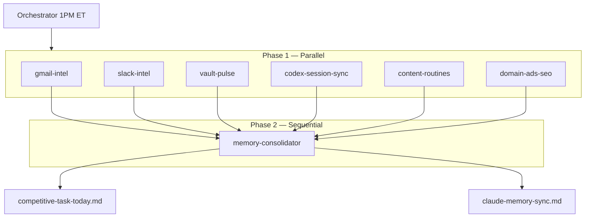

# SOP: Competitive Task Orchestrator

## Purpose

One umbrella automation replaces seven legacy crons. Dillon gets **one priority stack** per day instead of scattered pulses, digests, and sync jobs.

## Schedule

- **Cron:** `0 13 * * *` (1:00 PM ET daily)
- **Automation ID:** `competitive-task-orchestrator`
- **Prompt file:** [[System/competitive-task-orchestrator-prompt]]

## What you read

Open [[Daily-Briefs/competitive-task-today]] after lunch. That is the only required daily artifact.

## Architecture

## Subagent definitions

Located in `.cursor/agents/`:

| Agent | Role |
|-------|------|
| gmail-intel | Inbox urgency, urgent-replies.md |
| slack-intel | Slack DMs and channels |
| vault-pulse | Client note freshness, stalls |
| codex-session-sync | Session logs, open agent loops |
| content-routines | BOK Law + Align LinkedIn cadences |
| domain-ads-seo | Ads diagnostics, SEO queue |
| memory-consolidator | Merge all → one brief |

## P0 tie-break

When two tasks feel equal:

1. Launch blocked
2. Billing risk
3. Ad disapprovals
4. Hard calendar

## Setup checklist

- [ ] Gmail MCP connected to automation environment
- [ ] Slack MCP connected to automation environment
- [ ] Retire/disable the 7 legacy Cursor automations (if still scheduled)
- [ ] Keep only `competitive-task-orchestrator` cron active
- [ ] Add `last_touched` / `due` / `next_action` to client frontmatter over time

## Troubleshooting

See [[10_Sessions/Automation Debug Log]]. Common gap: Gmail MCP missing → brief shows STALE banner; connect MCP and re-run manually.
