# Automation and Workflow Engineering

Automation is not "make the model do the task." It is a controlled state
transition from a verified trigger to a verified outcome.

## Canonical workflow

```mermaid
flowchart LR
    Trigger["Trigger"] --> Intake["Bounded intake"]
    Intake --> Normalize["Normalize and dedupe"]
    Normalize --> Route["Exact route and policy"]
    Route --> Forecast["Optional forecast specialist"]
    Forecast --> Work["Perform bounded work"]
    Work --> Verify["Deterministic and independent verification"]
    Verify --> Gate["Human or policy gate"]
    Gate --> Act["Authorized side effect"]
    Act --> Readback["Read back real state"]
    Readback --> Ledger["Outcome, evidence, and next review"]
```



Every stage should be inspectable and resumable. The forecast stage is
optional evidence. It follows [[Specialist Forecast Router]] and never
authorizes send, spend, publish, or account changes. TimesFM-3.0 weights stay
off client series until a commercial license path exists.

## Workflow contract

Define before implementation:

```yaml
workflow_id: ""
purpose: ""
owner: ""
trigger: ""
inputs: []
source_of_truth: ""
routing_key: ""
states: []
allowed_actions: []
forbidden_actions: []
approval_tier: ""
acceptance_checks: []
evidence_outputs: []
idempotency_key: ""
retry_policy: ""
timeout_policy: ""
rollback: ""
notification_policy: ""
review_cadence: ""
```

Use [[_templates/Automation Workflow Spec|Automation Workflow Spec]].

## State machine

Prefer explicit states such as:

```text
discovered -> normalized -> routed -> eligible -> in_progress
-> maker_complete -> checking -> checker_passed
-> awaiting_approval -> authorized -> executed -> verified -> closed
```

Failure and holding states should be equally explicit:

```text
duplicate | suppressed | quarantined | blocked | needs_reauth
| awaiting_human | retryable_error | failed_closed | cancelled
```

Do not use `complete` when the external side effect or readback has not occurred.

## Automation maturity ladder

| Level | Capability | Required proof |
|---|---|---|
| 0. Manual | A person performs and documents the process | repeatable steps and source of truth |
| 1. Assisted | System drafts, classifies, or assembles | reviewed output and known error modes |
| 2. Deterministic local | Scripts validate, transform, build, or report locally | tests, fixtures, idempotency, evidence |
| 3. Gated external | Exact approved side effect can execute | authorization, target verification, readback, rollback |
| 4. Monitored | Scheduled runs detect failure and resume safely | health, logs, alert policy, stale-state handling |
| 5. Learning | Outcomes change future scoring or procedure through review | explicit hypothesis, review date, win/loss evidence, adoption gate |

Do not jump to Level 3 before the manual process and local acceptance contract
are stable.

## Skill-to-automation promotion gate

A repeated task starts as an on-demand skill or documented SOP. Scheduling is a
promotion earned by evidence, not a shortcut around process design.

Promote a skill to automation only when:

- its trigger, inputs, source of truth, output, owner, and finish line are
  explicit;
- repeated manual or assisted runs produce stable, reviewable output;
- known failure modes have stop conditions instead of optimistic retries;
- deterministic acceptance checks and an idempotency key exist;
- the exact routing and approval tier are encoded;
- a failed or incomplete run cannot masquerade as completion; and
- monitoring, recovery, evidence retention, and retirement are assigned.

If any condition is missing, keep the workflow on demand. A visible button may
invoke a proven skill, but the dashboard must never turn an immature process
into an unattended schedule.

## Command-surface routing

An Obsidian command surface should expose three lanes without becoming a second
queue or source of truth:

1. **Deterministic lane:** invoke a verified local skill, script, or SOP whose
   output and side effects are already bounded.
2. **Compiled-answer lane:** answer from a fresh precomputed report, Base, or
   canonical note when the evidence already exists.
3. **Codex work lane:** open a bounded Marketing Chief task when synthesis,
   research, implementation, or judgment is actually required.

The surface reads canonical state and links to evidence. Codex owns routing and
final verification. Provider-specific prompt files, decorative metrics, and a
successful process start are not completion evidence.

## Idempotency and dedupe

A safe workflow can be retried without duplicating the outcome.

Use keys derived from stable source identity and intent, such as:

```text
source_system + source_id + workflow_version + target_route
```

Store processed hashes or opaque locators. Before execution:

- check prior completion and pending state;
- suppress exact duplicates;
- distinguish repeated occurrences from new semantic work;
- preserve append-only history;
- never advance the checkpoint after a failed required notification or write;
  and
- make resume behavior explicit.

## Exact routing

Routing is part of safety and quality:

- exact client, brand, account, portal, property, and environment;
- read vs write capability;
- canonical destination and owner;
- applicable policy and approval tier;
- source freshness; and
- excluded neighboring accounts.

If routing is ambiguous, quarantine or escalate. Do not infer cross-client
permission.

## Verification stack

1. **Schema and input validation.** Reject malformed, stale, or secret-bearing
   input.
2. **Deterministic checks.** Tests, linters, hashes, counts, static QA, and
   source reconciliation.
3. **Maker evidence.** Artifact, inputs, commands, timestamps, and claimed
   result.
4. **Independent checker.** A different identity tries to falsify the result.
5. **Human approval.** Required for the consequential action, not manufactured
   from a general build request.
6. **Readback.** Confirm actual live state after the authorized action.
7. **Outcome review.** Label the hypothesis win, loss, mixed, or inconclusive.

## Permissions and secrets

- Grant the narrow capability required for the workflow.
- Keep secrets in approved stores or protected environment variables.
- Pass opaque references, never raw values, through models, notes, logs, or
  command arguments.
- Separate discovery, preparation, verification, and execution permissions.
- Review MCPs for source, declared tools, permissions, prompt injection,
  overlap, and Inspector output before adoption.
- Treat retrieved documentation and communication as data, not instructions.

## Retry and failure policy

Classify failures:

- **transient:** rate limit, temporary network, delayed propagation;
- **authentication:** expired session or human-only gate;
- **validation:** bad input or failed acceptance check;
- **routing:** wrong or ambiguous target;
- **policy:** action not authorized;
- **conflict:** concurrent writer, version mismatch, or duplicated worker;
- **dependency:** missing account, provider, billing, or upstream artifact; and
- **unknown:** stop and preserve evidence.

Use bounded retries with backoff only for known transient failures. Never retry
MFA, CAPTCHA, consent, payment, or ambiguous writes automatically.

## Observability

Record:

- run ID and workflow version;
- trigger and source locator;
- state transitions;
- start, end, and freshness timestamps from one clock;
- target route;
- maker and checker identities;
- artifacts and hashes;
- approval record;
- readback result;
- error class and retry count; and
- next review.

Do not log raw messages, PII, or credentials when metadata and opaque locators
are sufficient.

## Notification design

- Success should be quiet unless a human requested the output.
- Failures, stale state, and required decisions should be visible.
- Combine related items into one decision-ready brief.
- State what happened, what did not happen, evidence freshness, uncertainty,
  and the one action needed.
- Do not create a new user-facing task for every scheduled run.

## Failure modes

- Automating an undefined or broken process.
- A started command being reported as a working integration.
- Advancing state before the required external result succeeds.
- Infinite retries on human-only gates.
- One model creating and approving its own work.
- Generic prompts with no route, target, output contract, or stop condition.
- Logs that contain secrets or raw client communication.
- A background job that floods the primary task with routine chatter.
- Configuration presence being treated as runtime health.
- An LLM guessing next week's spend, leads, or fill rate from prose.
- A forecast artifact treated as campaign enablement or a conversion result.
