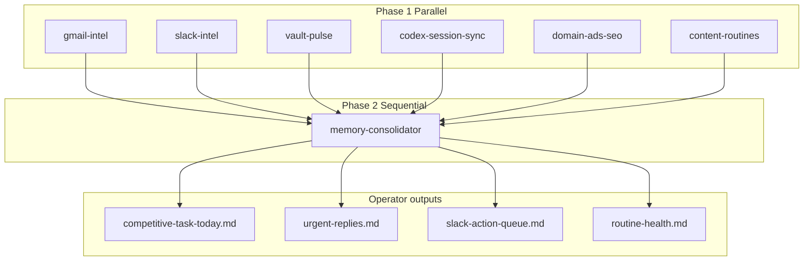

# Competitive Task Umbrella Workflow

One scheduled Cursor automation runs parallel intel agents at 1 PM ET, then one
consolidator writes the operator brief. Dillon opens a single file instead of
checking seven crons.

## Architecture

## What it replaces

Seven operator-facing crons merged into `competitive-task-orchestrator`. See
[[System/competitive-task-definition#Retired standalone crons]].

## What stays separate

- **Claude daily driver** — 54 bounded routines every 15 min; receipts, not operator UI.
- **Prospect radar** — daily factory output; separate `radar-*.md` brief.
- **64GB morning orchestrator** — local Chrome-tab execution; approval board when on machine.

Codex/Marketing Chief remains sole canonical writer; this workflow is read/analyze/draft only until approval.
