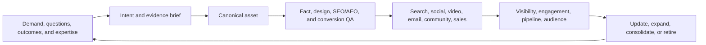

# Content Systems and Distribution

Content is not a pile of posts. It is an evidence-backed asset system that
helps the right audience understand, trust, remember, and act.

## Content loop

## Inputs

Prioritize:

- first-party search queries and ad terms;
- real sales, call, form, review, and support questions;
- qualified and lost opportunity reasons;
- original data and operating experience;
- product or service changes;
- competitor and referee-source gaps;
- client and stakeholder requests;
- time-sensitive trends with a dated source; and
- reusable findings from completed work.

## Asset hierarchy

### Canonical assets

Definitive guide, service page, product page, entity page, research report,
case study, calculator, assessment, template, or other durable destination.

### Supporting assets

Narrow question, comparison, use case, implementation detail, local proof,
video, or FAQ that strengthens a canonical asset.

### Distribution assets

Social post, email, short video, presentation, sales snippet, community answer,
press pitch, or paid creative that carries one idea to a specific audience and
links or points back to the canonical source when appropriate.

### Retention assets

Newsletter, sequence, resource library, update series, community, saved tool,
or re-engagement experience that creates a reason to return.

## The content brief

Specify:

- audience, problem, and decision stage;
- primary intent and entity;
- source-backed demand;
- unique contribution;
- claims and required evidence;
- questions and objections;
- page or asset role;
- direct answer or promise;
- structure and proof;
- internal links;
- conversion and retention path;
- distribution variants;
- measurement; and
- refresh date.

Use [[_templates/Content Cluster Brief|Content Cluster Brief]].

## Unique contribution test

Before producing, identify at least one:

- original result or data point;
- expert method;
- real example or case;
- proprietary tool or template;
- local or vertical experience;
- better comparison or synthesis;
- clearer explanation of a difficult process;
- current primary-source update; or
- point of view the brand can defend.

If the asset only restates the top results, improve the brief or do not build
it.

## Production contract

- Factual claims trace to sources.
- Voice fits the brand and audience.
- The primary answer appears without a long preamble.
- Structure supports scanning and depth.
- Images, examples, and proof are real or clearly labeled.
- The asset is accessible, responsive, and fast.
- Structured data matches visible content.
- The CTA matches the intent and actual offer.
- Tracking and lead delivery are tested.
- A different reviewer checks material work.

## Distribution system

Plan distribution before publishing:

- Search: query and cluster mapping, internal links, indexation, refresh.
- AI discovery: citation-ready structure, entity clarity, source ecosystem.
- Social: audience-specific hook, native value, proof, and visual format.
- Video: demonstration, explanation, personality, or proof with text context.
- Email: direct value, segmentation, owned-audience growth, and follow-up.
- Community: helpful participation without manufactured promotion.
- Sales: objection handling, proof snippets, proposal and meeting support.
- Paid: only when tracking, offer, landing path, and outcome definition are
  ready.

Repurpose the idea, not the exact formatting. Each channel has a different job.

## Owned audience

Traffic is fragile. Every important content system should have an appropriate
retention path:

- newsletter or update subscription;
- useful download or tool;
- saved assessment or personalized result;
- follow-up sequence;
- event, community, or release notification; or
- product or service nurture.

Verify delivery before promotion. A form submission without successful
delivery is not a functioning funnel.

## Refresh and retirement

Trigger review when:

- facts, prices, policies, products, or dates change;
- rankings, citations, or qualified performance materially decline;
- multiple pages compete for the same intent;
- a source expires;
- the conversion path changes;
- the asset no longer supports a live offer; or
- stronger evidence changes the conclusion.

Choose update, consolidate, redirect, archive, or retire. Do not leave stale
authority pages live by default.

## Scorecard

- priority intent and topic coverage;
- production and refresh cycle time;
- qualified organic sessions;
- citations and source mix;
- email subscribers, returning visitors, and third-visit retention;
- assisted and direct qualified outcomes;
- content-to-offer progression;
- distribution reuse per canonical asset; and
- decaying, duplicate, or unsupported content.

## Failure modes

- Publishing volume as the goal.
- Producing before defining distribution and conversion.
- Generic AI summaries with no original evidence.
- Copying one piece into every channel unchanged.
- Sending traffic to a broken form or unclear offer.
- Treating social engagement as pipeline without linkage.
- Forgetting to update time-sensitive content.
- Making every page transactional and losing trust.

