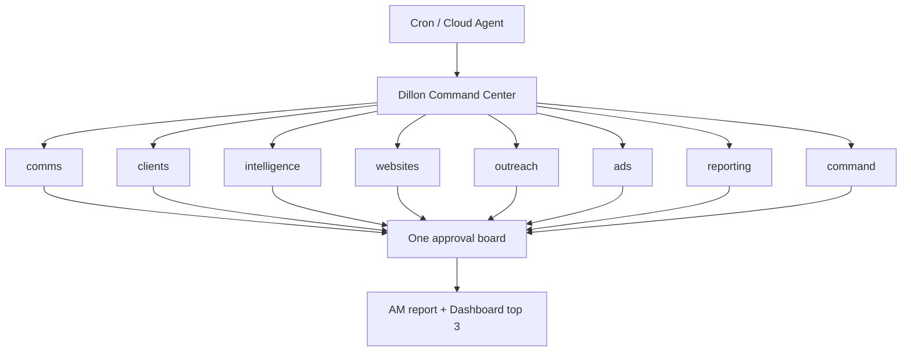

# Dillon Command Center

Dillon OS had too many overlapping morning automations: Slack intake, AM report,
client pulse, prospect radar, Claude daily driver, and ad-hoc Codex sessions all
competing for attention. The Command Center collapses the **morning competitive
task loop** into one orchestrator with eight parallel lanes.

## Architecture



## Eight lanes

| Lane | Agent | Competitive work |
|------|-------|------------------|
| comms | chief-of-staff | Unanswered Slack/Gmail boss requests |
| clients | marketing-chief | Roster movement, stalled deliverables |
| intelligence | brain-curator | Radar, Grok, stale research |
| websites | web-product-builder | LP queue, site health, publish-ready |
| outreach | growth-content | 207+ prospect rebuild queue |
| ads | paid-media-analyst | Billing blocks, disapprovals, attribution |
| reporting | paid-media-analyst | Draft client reports |
| command | marketing-chief | Approval queue scoreboard, today's top 3 |

## Priority contract

P0 tie-break: launch blocked → billing risk → ad disapprovals → calendar.

## Runtime

```bash
node _os/automation/bin/dillon-command.js run --print-board
```

Artifacts land in `automation-runs/dillon-command/YYYY-MM-DD/`.

## What stays separate

- **Claude daily driver** — 15-minute micro-routine gate (54 routines)
- **Prospect Radar Next 20** — 05:20 heavy batch site builder
- **Agent-memory vault sync** — hourly memory projection

Those are infrastructure or batch builders, not morning competitive-task scouts.

## Operator output

One push per cycle: approval board + AM report PR. Dillon approves Tier 1
batch once; Tier 2 stays live-only.
