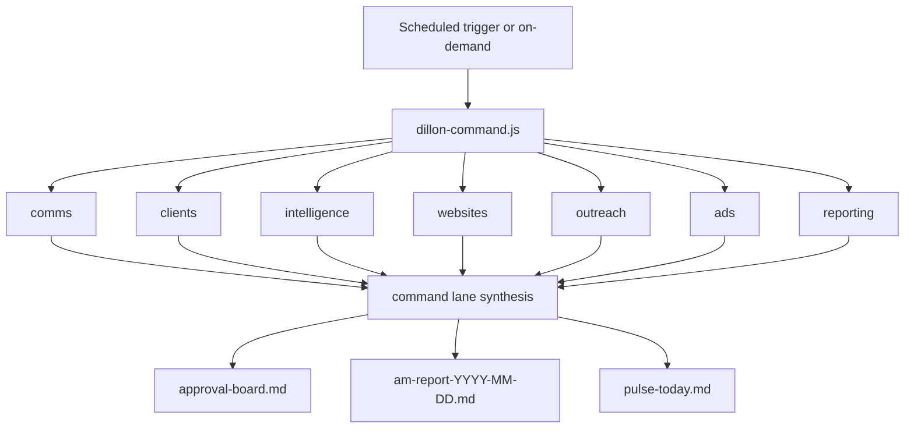

# Dillon Command Center

Competing automations were doing overlapping work: morning Slack intake, AM report,
client pulse, Claude daily driver receipts, prospect radar, Grok ingest, and
scattered registry jobs. Dillon Command Center is the **one scheduled umbrella**
that fans out eight parallel lanes and synthesizes a single approval board.

## Architecture

## Eight lanes

| Lane | Primary evidence | Agent owner |
|---|---|---|
| comms | `00_Inbox/slack/`, communication state | chief-of-staff |
| clients | `01_Clients/` pulse, client approval items | marketing-chief |
| intelligence | Grok ingest, research, craft brief | brain-curator |
| websites | site health, radar, LP queue | web-product-builder |
| outreach | prospect rebuild queue | growth-content |
| ads | billing/disapproval/campaign gates | paid-media-analyst |
| reporting | report ingest state | paid-media-analyst |
| command | P0 ranking across all lanes | marketing-chief |

## Operator contract

- **One push per cycle:** approval board + AM report PR
- **P0 tie-break:** launch blocked → billing risk → ad disapprovals → calendar
- **Tier 2 stays gated:** send, publish, deploy, spend, account change
- **Retained micro-loops:** Claude daily driver (15m), Prospect Radar Next 20 (05:20)

## Entry points

- CLI: `node _os/automation/bin/dillon-command.js run --agent-mode`
- Skill: `.claude/skills/dillon-command/SKILL.md`
- Registry: `12_Brain/registry/automations.json` → `dillon-command`
- Artifacts: `automation-runs/dillon-command/YYYY-MM-DD/`

## Supersedes

- [[handoffs/Morning Loop Scheduled Agent Setup|Morning Loop three-step cron]]
- Separate cloud agents for slack-intake, am-report, and client-pulse alone

## Related

- [[12_Brain/03_Concepts/Automation and Workflow Engineering]]
- [[11_Agents/64gb Morning Orchestrator Spec 2026-07-08]]
