# Marketing Intelligence Operating System

This is the canonical strategy map for what Dillon OS has learned about
research, marketing execution, automation, websites, and measurement. It is a
system of connected loops, not a collection of tactics.

## The operating model

```mermaid
flowchart LR
    Evidence["Evidence and demand signals"] --> Interpret["Intent, entities, and opportunity model"]
    Interpret --> Decide["Prioritized strategy and finite outcome"]
    Decide --> Build["Content, campaign, website, or workflow"]
    Build --> Verify["Deterministic QA and independent check"]
    Verify --> Gate["Approval for consequential action"]
    Gate --> Observe["Traffic, citations, qualified pipeline, and revenue"]
    Observe --> Learn["Decision, outcome, and reusable precedent"]
    Learn --> Evidence
```



Every operating lane should answer seven questions:

1. What current evidence created the opportunity?
2. Which audience, problem, intent, entity, and business outcome are involved?
3. What is the smallest high-leverage asset or change?
4. What acceptance contract defines quality?
5. What human gate remains?
6. What business result will be observed?
7. What did the result teach the next run?

## Strategy library

### Demand and content

- [[12_Brain/03_Concepts/Keyword Research and Search Demand|Keyword Research and Search Demand]]
- [[12_Brain/03_Concepts/Search Intent and Topic Architecture|Search Intent and Topic Architecture]]
- [[12_Brain/03_Concepts/Content Systems and Distribution|Content Systems and Distribution]]

### Search, answer engines, and authority

- [[12_Brain/03_Concepts/AEO GEO and AI Discovery|AEO, GEO, and AI Discovery]]
- [[12_Brain/03_Concepts/Entity Authority and Citation Readiness|Entity Authority and Citation Readiness]]
- [[12_Brain/03_Concepts/Local Search and Maps Site Parity|Local Search and Maps-to-Site Parity]]
- [[12_Brain/03_Concepts/AI Visibility Measurement|AI Visibility Measurement]]

### Growth and revenue

- [[12_Brain/03_Concepts/Qualified Pipeline Measurement|Qualified Pipeline Measurement]]
- [[12_Brain/03_Concepts/Client Reporting and Outcome Scoreboards|Client Reporting and Outcome Scoreboards]]
- [[12_Brain/03_Concepts/Prospect to Build to Outreach Pipeline|Prospect-to-Build-to-Outreach Pipeline]]

### Production and operations

- [[12_Brain/03_Concepts/High Craft Website Factory|High-Craft Website Factory]]
- [[12_Brain/03_Concepts/Automation and Workflow Engineering|Automation and Workflow Engineering]]
- [[12_Brain/03_Concepts/Agent Governance and Verification|Agent Governance and Verification]]
- [[12_Brain/03_Concepts/Evidence Context and Learning Loops|Evidence, Context, and Learning Loops]]
- [[12_Brain/03_Concepts/Specialist Forecast Router|Specialist Forecast Router]]
- [[12_Brain/03_Concepts/Leading Indicators|Leading Indicators]]

## Signal hierarchy

Use the strongest available evidence and label what each source can actually
prove.

| Strength | Sources | What they can support |
|---|---|---|
| 1. Business outcomes | CRM stages, booked appointments, signed work, revenue, verified lead dispositions | Whether marketing created business value |
| 2. First-party behavior | Search Console, Ads search terms, calls, forms, analytics, site search, email engagement | What people encountered and did |
| 3. Platform opportunity | Keyword Planner, Trends, Bing AI Performance, citation exports | Relative demand, cost, visibility, and change |
| 4. Customer language | Reviews, sales calls, Slack, email, forums, autocomplete, support questions | Vocabulary, objections, questions, and jobs to be done |
| 5. External research | Official documentation, studies, expert analysis | Methods and hypotheses that still require local validation |
| 6. Model output | AI summaries, classifications, recommendations, forecast bands | Draft interpretation only, never proof. Quantile forecasts are still model output. |

## One demand model

Search, paid media, content, AI answers, social discovery, and sales calls are
different views of the same demand system. A useful opportunity record joins:

```text
audience + problem + intent + entity + market + language
+ current evidence + proposed asset + conversion path + outcome metric
```

Keywords are observations within that record. They are not the strategy by
themselves.

## One asset model

Every asset should have:

- one primary audience and job;
- one primary intent and next action;
- a clear entity or subject;
- source-backed claims;
- a canonical URL or delivery location;
- a measurement plan;
- an owner, freshness date, and update trigger; and
- a rollback or retirement path when it changes production state.

## One measurement model

Do not collapse unlike metrics into one success number. Use four layers:

1. **Eligibility:** crawlable, indexable, technically valid, and routed.
2. **Visibility:** impressions, rankings, answer citations, mentions, and reach.
3. **Engagement:** clicks, qualified visits, scans, form starts, calls, and replies.
4. **Business outcome:** qualified opportunity, estimate, appointment, booked
   work, contract, revenue, retention, or owned-audience growth.

The top layer diagnoses the bottom layer. It never substitutes for it.

## Prioritization

Rank proposed work with the following logic:

```text
expected business value
x evidence confidence
x strategic reuse
x time sensitivity
divided by effort, risk, and external dependency
```

Prefer a small build that closes a measured loop over a large build that adds a
new surface without proving an outcome.

## Operating cadence

### Daily

- Ingest material demand and client signals.
- Route them to the exact client, venture, or system.
- Update a canonical concept, project, decision, or client note only when the
  signal changes the current model.
- Execute the highest safe finite outcome.

### Twice weekly

- Reconcile search queries, ad terms, calls, forms, and CRM outcomes.
- Review negative intent and content gaps.
- Check production health and unresolved human gates.

### Weekly

- Review strategy and outcome scoreboards.
- Run the knowledge coverage report.
- Promote verified learning and retire weak experiments.
- Select the next build by leverage, not novelty.

### Monthly

- Refresh keyword clusters, citation prompts, entity parity, and competitor
  source patterns.
- Audit source freshness, duplicate concepts, broken links, and thin areas.
- Revalidate platform-specific guidance.

## Anti-patterns

- Building another dashboard that does not change a decision.
- Treating a ranking, click, platform conversion, AI mention, or automation run
  as business success without downstream evidence.
- Creating a note per keyword instead of a reusable intent and entity model.
- Letting research auto-install tools or auto-change strategy.
- Writing schema, FAQs, or `llms.txt` as a substitute for useful visible content.
- Automating a broken or undefined manual process.
- Letting an agent verify its own material claim.
- Copying raw communication into the knowledge layer.
- Asking an LLM to project next month's spend, leads, or pipeline from a paragraph.

## Reusable starting points

- [[_templates/Keyword Research Brief|Keyword Research Brief]]
- [[_templates/Content Cluster Brief|Content Cluster Brief]]
- [[_templates/AEO GEO Strategy|AEO/GEO Strategy]]
- [[_templates/Automation Workflow Spec|Automation Workflow Spec]]
- [[_templates/Outcome Scoreboard|Outcome Scoreboard]]

