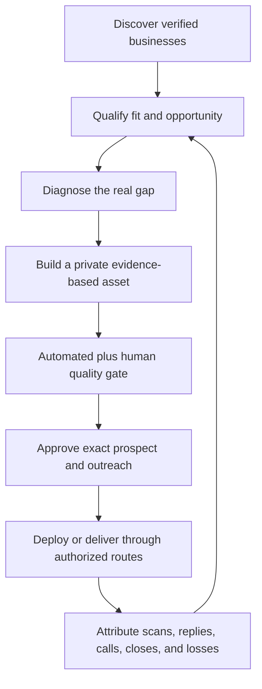

# Prospect-to-Build-to-Outreach Pipeline

The pipeline creates value before the sales call while preserving identity,
fact, permission, quality, and delivery gates.

## Eight stages

## 1. Discover

Create one stable prospect record from approved sources.

Minimum fields:

- stable prospect ID and source;
- business name, category, market, and website;
- public Maps or profile locator;
- current site and contact route;
- review count/rating where relevant;
- source timestamp; and
- suppression status.

Deduplicate by stable platform or place ID where possible. Suppress existing
clients, current deals, prior opt-outs, prior mailings, and ambiguous identities.

## 2. Qualify

Score:

- vertical and market fit;
- visible site or conversion decay;
- local visibility gap;
- ability-to-pay proxies with explicit limits;
- active advertising or demand evidence;
- availability of trustworthy source material;
- potential outcome value;
- existing relationship or conflict; and
- build effort and compliance risk.

Record reasons, not only a number. A high score does not authorize contact.

## 3. Diagnose

Identify the smallest valuable gap:

- outdated or broken site;
- unclear offer or conversion path;
- weak mobile UX;
- missing trust or proof;
- local/Maps inconsistency;
- search intent and content gap;
- slow or broken form; or
- opportunity for a calculator, audit, or interactive tool.

Do not assume every prospect needs a full website.

## 4. Build

Create a private, source-backed demo or audit that:

- preserves factual accuracy;
- reflects the real business voice and visual identity;
- solves the diagnosed gap;
- avoids official-site or endorsement claims;
- uses licensed, first-party, or clearly generated imagery with provenance;
- remains `noindex`; and
- includes a clear explanation of what is proposed versus verified.

Use [[12_Brain/03_Concepts/High Craft Website Factory|High-Craft Website Factory]].

## 5. Quality gate

- full static, responsive, visual, and functional QA;
- AEO/trust gate where relevant;
- duplicate-image and sameness checks across batches;
- independent checker;
- source and fact verification;
- private/noindex verification; and
- one review hub plus a concise walkthrough for batch approval.

Static-only QA is not a full pass.

## 6. Human approval

Show the exact:

- prospect list;
- artifact and destination;
- outreach copy;
- channel or mail piece;
- quantity and cost;
- sender identity;
- approval scope; and
- rollback or suppression path.

Approval applies only to that package.

## 7. Activate

Activation may include an approved mapped preview, QR record, direct mail,
email, or other channel. Each provider and channel must have:

- authenticated exact account;
- approved sender and return details;
- protected secret route;
- test-mode verification;
- dedupe and suppression;
- spend and quantity ceiling;
- successful readback; and
- no automatic expansion beyond the approved batch.

The local direct-mail planner may prepare fingerprints and gate status. It does
not send or change `mail_ready`.

## 8. Learn

Track by batch, market, vertical, diagnosis, offer, design direction, and
channel:

- prospects discovered and qualified;
- builds completed and QA pass rate;
- approval rate;
- mail or messages delivered;
- QR scans and site visits;
- replies, calls, and meetings;
- qualified opportunities and closes;
- cost and time per stage;
- opt-outs and negative feedback; and
- lost reason or inconclusive status.

Update scoring and production only after enough evidence exists. Preserve
weak or negative results; they are part of the model.

## Failure modes

- Scraping or contacting through an unapproved source.
- Building for businesses already in the client or sales pipeline.
- Inventing facts because the harvest is thin.
- Using a demo as an official public site.
- Sending because a row says `ready` without exact approval.
- Treating QR creation as proof that direct mail is integrated.
- Measuring sites built while ignoring calls and closes.
- Over-investing in bespoke builds before qualification.
- Scaling nationally before one market/vertical loop is understood.

