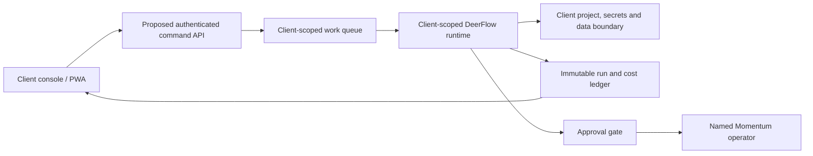

# Dedicated AI workforce offer

## Decision

The idea is viable if Momentum sells a **managed specialist team with bounded outcomes, named human ownership, and evidence of completion**. Models and keys are replaceable infrastructure beneath that service.

Do not sell an API key as an employee, a model name as competence, or an always-running loop as reliability. A dedicated agent is a persistent client-scoped role with approved context, tools, budgets, evaluations, work history, and support. It does not require one container, model process, or provider key per role.

## What the client buys

1. **Readiness Sprint**: audit one workload, data estate, access path, risks, and acceptance baseline; deliver a fixed-scope build decision.
2. **Build or Migration Engagement**: deliver one defined engineering or data outcome in approval-gated phases with an independent verification and accepted handoff.
3. **Managed Agent Team**: reserved workload and concurrency, monitoring, maintenance, model evaluations, measured usage, named operator coverage, and monthly outcome review.

This preserves the DataStrike shape of readiness, migration, managed operations, and BI while using BrainForge's bounded discovery, build, and managed-support sequence.

## The first sellable team

| Role | Responsibility | Production boundary |
| --- | --- | --- |
| Solutions architect | Scope, dependency map, target design, risk and rollback plan | Proposes; cannot approve its own production change |
| Migration engineer | Schema mapping, transform code, rehearsal, validation and runbook | Disposable or approved environment only until cutover authority |
| Analytics and BI engineer | Semantic model, KPI definitions, data-quality tests and Power BI specification | No business-metric claim without source and owner acceptance |
| Independent verifier | Reconcile records, tests, costs, evidence and acceptance contract | Cannot modify the artifact it signs off on |
| Named Momentum operator | Own access, approvals, client communication, incidents and final accountability | Human authority remains explicit |

Economy and Frontier are routing policies inside the same persistent roles:

- **Economy route**: bounded extraction, transforms, test generation, documentation, monitoring and routine coding.
- **Frontier route**: architecture, ambiguous migrations, difficult schema reasoning, failure diagnosis, final review and escalation.
- **Upgrade**: increases eligible models, workload, concurrency and review coverage without replacing the client's agent identity or history.

Meta Muse Spark 1.3 Contributor is cheap enough for bounded contributor work, but its current OpenRouter listing states that prompts and outputs may be used to improve Meta products. It is not the default for confidential client data. Claude Fable Latest currently requires retention and does not permit zero-data-retention, so it is excluded from ZDR-required workloads.

## Capability matrix, not an “all databases” promise

DataStrike publicly covers SQL Server, Oracle, MySQL, PostgreSQL, MongoDB, SAP HANA, MariaDB and Redshift, plus AWS, Azure, Oracle Cloud, Snowflake, Power BI, Databricks and Microsoft Fabric. That catalog is the roadmap, not Momentum's current proof.

Each source-target-operation combination must earn its own status:

| Capability | Initial status | Evidence required to promote it |
| --- | --- | --- |
| Read-only estate assessment | pilot candidate | Complete inventory, dependency map, access proof and reviewed recommendations |
| Relational migration rehearsal | pilot candidate | Repeatable fixture, mapping, reconciliation, restart safety and rollback proof |
| Power BI / semantic-model build | pilot candidate | Independent KPI fixtures, row-level-security tests and owner acceptance |
| SQL Server / Oracle / PostgreSQL / MySQL | unverified by engine | Versioned runbook and successful disposable-data rehearsal per engine |
| MongoDB / document migration | unverified | Separate document-shape, index, consistency and application-compatibility proof |
| Azure SQL / Fabric / Snowflake / Databricks | unverified by platform | Platform-specific security, cost, pipeline and recovery acceptance suite |
| Production cutover or managed DBA operations | later | Qualified operator, backup and restore proof, maintenance policy, incident coverage and explicit client authority |

## Key ownership and billing

### Recommended pilot: client-owned inference

- Client owns the provider or OpenRouter organization, workspace, payment method and management key.
- Momentum receives only the minimum operational credential needed in the client environment's secret store.
- Issue scoped keys by tenant, role and environment; apply model/provider allowlists, expiration, rotation and budgets.
- Disable unapproved shared-capacity fallback so a failed client key cannot silently charge Momentum.
- Client pays inference directly; Momentum invoices readiness, delivery, management and clearly defined operator overage.

The commercial wording is **client-paid inference at vendor rates plus Momentum management**, not “discounted frontier tokens.”

### Later: Momentum-managed inference

Only after the ledger reconciles with provider invoices may Momentum pay inference and pass through attributable usage plus disclosed platform and management charges. Never pool clients behind one untraceable key.

OpenRouter supports workspaces, system keys, guardrails and management-key provisioning. Those controls improve attribution and limits; they do not create tenant isolation by themselves. Its current activity endpoint is limited to the last 30 UTC days, so Momentum needs its own immutable ledger.

Required ledger fields: tenant, agent role, environment, run and generation IDs, key hash, requested model, resolved permanent model, provider, input/output/reasoning tokens, direct cost, retries, cache/batch adjustments, tools, operator review, final outcome and receipt hash.

## Pricing framework

Do not publish exact rates until the pilot measures real cost and support load.

- **Readiness fee** = scoped delivery hours × loaded rate + model/tool/infra cost + risk reserve.
- **Build or migration fee** = discovery + source/target complexity + data volume/quality + environments + validation + cutover/rollback risk + specialist review.
- **Managed monthly floor** = (provider usage + infrastructure allocation + operator hours × loaded cost + QA/support/incident reserve) ÷ (1 − target gross margin).
- **Overage** = measured usage and operator time at disclosed rates. No “unlimited agents.”

Bundle discounts may come from shared onboarding and lower management overhead after measurement. They do not make provider tokens cheaper. The proposed 30–40% discount is therefore not a frontier-token promise. If used later, it must be a capped, time-limited discount against Momentum's management fee or a demonstrated total-cost baseline.

## Model release and self-improvement policy

Production routes stay pinned to an approved model version. A catalog watcher may discover new generally available models, but discovery cannot promote them.

Promotion sequence:

1. Verify model ID, provider terms, retention, region, parameters, tool behavior and price.
2. Run the client-specific regression and adversarial suite in evaluation.
3. Compare quality, latency and full cost, including retries and operator rework.
4. Obtain operator approval.
5. Canary only low-risk work.
6. Promote a versioned route with recorded evidence and immediate rollback.

“Self-improving” means measured, reviewable updates to prompts, tools, routing and runbooks. It never means self-granted access, self-approved spend, automatic production migration, silent model switching, or an agent approving its own output.

## Client access architecture

- Reuse the existing console/PWA now as a read-only mirror for invitations, status, artifacts and usage. Interactive client requests require the proposed command API and queue; they are not current capability.
- For the first external client, use a separate DeerFlow Compose project with its own environment, volumes, database, auth secret, provider key and URL. Mount only that client's project and approved data. Mirror receipts back to the existing console.
- A shared DeerFlow deployment may come later, but only after server-side authorization and secret routing are proven. Current user-scoped threads do not override global mounts or global runtime state.
- Keep the current privileged operator container separate. Its host mounts and operator context make it unsuitable as a client execution boundary.
- Bind authenticated tenant identity to every job, thread, file, memory record, tool call, secret lookup and artifact on the server.
- A GPT/site collaboration link can be a demo or front door. It is not authentication, authorization, data isolation, metering or an execution boundary.

### Four gates before a second tenant

1. **Isolation**: a separate client Compose project has no operator host mounts, raw histories, cross-client credentials, shared volumes, shared database or shared auth context.
2. **Denial tests**: foreign-tenant reads, artifact fetches, memory access, tool execution, secret lookup and job submission all fail and are recorded.
3. **Scoped inference**: test and production keys, provider/model allowlists, budget behavior, fallback behavior and ledger reconciliation are demonstrated without exposing key values.
4. **Recovery and governance**: approval enforcement, cancellation, timeout, retry deduplication, backup/restore, audit retention, model rollback and operator incident ownership are exercised.

## First engineering pilot

Keep the existing leads-triage pilot as the business-operations proof. It is not the database-engineering proof.

The first engineering pilot is a read-only assessment of one Momentum reporting pipeline, followed by a migration rehearsal into a disposable target using synthetic or explicitly approved sanitized data.

Required artifacts:

- source inventory and dependency map;
- supported versions and schema assumptions;
- source-to-target mapping and migration program;
- reconciliation of row counts, keys, relationships, nulls, precision and timestamps;
- safe rerun and interrupted-run evidence;
- restore and rollback demonstration;
- analytics semantic-model specification with independently calculated fixtures;
- operator runbook;
- immutable receipt with model usage, retries, full cost and human review time;
- independent verifier result.

No production database writes or cutover are part of this pilot. Promotion requires the engineering acceptance suite, two clean weeks of relevant internal operation, and a separately accepted first-client scope.

## Current evidence and open gaps

Observed September 19 at approximately 17:45 ET:

- Four DeerFlow containers running; gateway and Redis healthy.
- `GET /health/ready` returned HTTP 200 with database and checkpointer `ok`.
- Existing native-subagent settings allow three running and 64 queued; this is configuration, not measured commercial capacity.
- SQLite, one gateway process, disabled authorization policy and token budget, privileged operator mounts, unresolved phantom Tavily grants, and unverified client isolation/metering remain.
- The existing Momentum cloud console provides signed, tenant-filtered read-only views; it does not yet provide a client command channel or dedicated execution.
- No database-migration agent, self-upgrade lane, per-client billing ledger, second-tenant denial proof or client-ready execution boundary is verified.

Docker Gordon was consulted. Its useful recommendations were the separate client runtime, denial tests, scoped BYOK flow and operator credential isolation. Its claims that multi-tenant thread isolation is already verified and that lead triage is the first engineering pilot were rejected as unsupported or off-scope.

## Public reference research

- DataStrike's public services validate the target categories: database/cloud migration and managed services, SQL Server/Oracle/MySQL/PostgreSQL/MongoDB and other engines, Power BI/Databricks/Snowflake/Fabric, readiness and ongoing operations.
- Public profile research suggests the user's “Brian Windeland” is likely **Brian Wineland**; spelling and current title need confirmation before client-facing use. Corey Beck's public profile centers cloud/database work; Brian Boback's public profile centers cloud, AI and data-platform architecture. These are research inspirations, not personas to clone or claims of endorsement.
- BrainForge's public model validates a senior delivery team, bounded Crawl/Walk/Run engagements, human approvals, context engineering, traces/evaluations and client-owned environments. Momentum should adapt the delivery pattern, not copy proprietary people or wording.

## Next action

Run the disposable reporting-migration rehearsal and produce the evidence pack above. Pricing, “all major databases,” client invitations, automatic model promotion and discount claims remain **proposed** until that proof exists.

## Project checkpoint

- Outcome: dedicated AI workforce offer, architecture, billing modes, governance and pilot defined.
- Owner: Momentum AI Division; named human operator remains mandatory.
- State: decision-ready proposal; no client launch, production migration, access change or spend performed.
- Evidence: current Docker health readback, Astra review, Gordon consultation, repo inspection and primary-source research.
- First build: disposable reporting-data migration rehearsal with independent reconciliation and rollback evidence.
- Client route: read-only existing console now; isolated per-client Compose runtime before interactive external access.
- Commercial gate: measure provider cost, retries and operator time before publishing rates or discount claims.
- Launch gate: two clean internal weeks plus second-tenant denial tests and accepted first-client scope.

## Sources

- [[AI Division business plan]]
- [[2026-09-14 - Managed Agents, measured]]
- [DataStrike services overview](https://www.datastrike.com/services-overview)
- [DataStrike database migration services](https://www.datastrike.com/database-migration-services)
- [DataStrike Microsoft Fabric expansion](https://www.datastrike.com/blogs/datastrike-expands-microsoft-fabric-services-to-help-organizations-move-faster-with-analytics-and-ai)
- [Corey Beck public LinkedIn profile](https://www.linkedin.com/in/corey-beck-53824183)
- [Brian Wineland public LinkedIn profile](https://www.linkedin.com/in/brian-wineland-8507926a)
- [Brian Boback public LinkedIn profile](https://www.linkedin.com/in/bbob)
- [BrainForge AI services](https://brainforge.ai/services/ai/)
- [BrainForge data services](https://brainforge.ai/services/data/)
- [BrainForge strategy and analytics](https://brainforge.ai/services/strategy-analytics/)
- [BrainForge pricing and delivery model](https://brainforge.ai/pricing/)
- [OpenRouter pricing](https://openrouter.ai/pricing)
- [OpenRouter BYOK](https://openrouter.ai/docs/guides/overview/auth/byok)
- [OpenRouter workspaces](https://openrouter.ai/docs/guides/features/workspaces/overview)
- [OpenRouter management keys](https://openrouter.ai/docs/guides/overview/auth/management-api-keys)
- [OpenRouter guardrails](https://openrouter.ai/docs/guides/features/guardrails/overview)
- [OpenRouter activity API](https://openrouter.ai/docs/api/api-reference/analytics/get-user-activity-grouped-by-endpoint)
- [Meta Muse Spark 1.3 Contributor](https://openrouter.ai/meta/muse-spark-1.3-contributor)
- [Claude Fable Latest](https://openrouter.ai/~anthropic/claude-fable-latest)
- `C:/Users/dillo/Documents/Qwen/deer-flow/outbox-host/reports/GORDON-SUPERVISED-LOOP-2026-09-19.md`
