# 120-Day Slack Operating System Audit

## Executive verdict

The proposed model is correct: Slack should be the sensing layer, the Marketing Chief should decide and compile the work contract, and Codex should build the deliverable. The Slack-facing component should not try to make the landing page, report, campaign analysis, video brief, or client response itself.

The decisive missing piece is not another model or a larger memory store. It is a durable request-episode and open-loop layer between Slack and Codex. That layer must join fragmented messages into one unit of work, resolve the exact client and destination, infer the real deliverable, track dependencies and approvals, deduplicate against current work, compile a Dillon-quality prompt, dispatch bounded execution, and verify closure.

The current system already has strong execution primitives. Its 54-routine operating team covers routing, inferred deliverables, web builds, content, paid-media review, reporting, QA, approvals, readback, and learning. What it does not yet have is a reliable connective spine from live Slack activity to those routines.

The safest target is a hybrid Company OS:

- EOS-style accountability, issue, and open-loop discipline.
- Event-sourced Slack intake and exact source binding.
- The existing Marketing Chief as the sole queue writer and final authority.
- Codex as the maker and orchestrator, with an independent checker.
- RAG as a bounded context compiler, not a dump of the entire memory bank.
- Existing approval gates for sending, publishing, spend, account changes, authentication, and destructive actions.

## Audit scope and completeness

The audit covered April 18 through August 15, 2026, an inclusive 120-day window.

| Coverage measure | Result |
| --- | ---: |
| Conversations discovered | 135 |
| Public channels | 15 |
| Private channels | 35 |
| Multi-person DMs | 22 |
| One-to-one DMs | 63 |
| Conversations with activity in the window | 95 |
| Accessible conversations | 134 |
| Root messages read | 22,209 |
| Threaded discussions read | 1,286 of 1,286 |
| Thread replies returned | 4,546 |
| Total accessible messages read | 26,755 |
| Messages represented by Slack counts | 26,760 |

The only inaccessible conversation was Slackbot's system DM. Four thread parents reported five replies that Slack no longer returned, consistent with deleted or stale reply-count state. Every accessible human, client, project, public, private, group-DM, and direct-message surface discovered by the connector was inspected. Raw private message bodies were not copied into this report.

## What Dillon actually does

Dillon is functioning as an AI Marketing Director and delivery integrator, not as a single-channel specialist. The work combines strategy, production, operations, quality control, account management, and systems engineering.

| Operating role | What the Slack record shows | Typical output |
| --- | --- | --- |
| Client strategist and account lead | Interprets requests, translates client goals, corrects misunderstandings, gives status, manages expectations, and chooses the next practical move | Client update, plan, recommendation, approval package |
| Website and product builder | Builds and revises sites, landing pages, dashboards, prototypes, funnels, and conversion paths | Live or staged page, product surface, implementation receipt |
| AI and automation architect | Tests new models and agents, designs workflows, connects systems, and turns recurring work into reusable machinery | Agent workflow, prototype, automation, operating rule |
| Performance marketer | Reviews Google and Meta delivery, tracking, conversion setup, lead quality, and campaign readiness | Read-only audit, optimization plan, launch gate |
| Reporting and analytics lead | Produces weekly updates, monthly recaps, dashboards, KPI narratives, and evidence-backed explanations | Report, dashboard, executive summary |
| SEO, AEO, GEO, and GBP strategist | Works on search visibility, authority, content architecture, local presence, and AI discovery | Search plan, content set, GBP action plan, audit |
| Creative and video producer | Generates concepts, AI video experiments, design direction, social assets, and longer-form creative | Video, creative brief, asset package, review notes |
| Access and integration troubleshooter | Resolves permissions, account access, tracking, CRM, CallRail, HubSpot, GHL, and platform problems | Restored access path, integration diagnosis, blocker handoff |
| Sales and solution engineer | Shapes offers, proposals, proof-of-concepts, case studies, productized services, and client-facing technical explanations | Proposal, scope, demo, case study, offer |
| QA and approval broker | Reviews work from teammates and agents, distinguishes built from live, catches overclaims, and moves work through approval | Critique, revision request, readiness decision, verified handoff |
| Internal coordinator and teacher | Answers questions, coaches teammates, translates technology, coordinates calls, and supplies missing context | Instruction, agenda, delegation, decision record |

This is why a generic Slack summarizer will fail. A short request such as “can we do this,” “make a page,” “what do you think,” or “where are we on this” can imply research, routing, asset collection, implementation, QA, deployment rules, reporting, and a response preview.

## Dillon's operating rhythm

Dillon authored 3,245 accessible Slack messages in the window, 12.1 percent of all retrieved traffic.

- Active on 116 of 120 days.
- Median of 26 messages per active day.
- Seventy-fifth percentile of 41 messages.
- Peak of 82 messages in one day.
- 6.8 percent of messages occurred on weekends.
- 9.4 percent occurred before 8:00 AM or at or after 8:00 PM Eastern.
- Activity is concentrated from late morning through late afternoon, with noon, 2:00 PM, 3:00 PM, 4:00 PM, and 1:00 PM the five busiest hours.

| Day | Dillon messages |
| --- | ---: |
| Monday | 721 |
| Tuesday | 627 |
| Wednesday | 654 |
| Thursday | 550 |
| Friday | 471 |
| Saturday | 144 |
| Sunday | 78 |

The pattern is a high-interruption operating role. Monday carries the heaviest coordination and planning load. The rest of the week blends production, review, troubleshooting, client communication, and follow-up. Weekend and after-hours activity is material but not dominant, which means the system should reduce spillover instead of normalizing it.

## Where work enters

The largest one-to-one DM relationship was Sean Boyle, with 822 messages represented in the window. Other high-volume DM relationships included Jason Fallon, Beth Kann, Jenny McClain Miller, Mac Frederick, Melissa Rigby, Cursor, and Grace Slagle.

The highest-volume conversation surfaces were:

| Conversation | Messages represented |
| --- | ---: |
| #360ops | 4,206 |
| #calls | 3,241 |
| #360leads | 1,521 |
| #momentumsites | 1,320 |
| #gmbs-reinstatement | 1,292 |
| #ghl-leads-apollo | 1,258 |
| #design-social-email | 990 |
| #360newprojects | 977 |
| Sean Boyle DM | 822 |
| #360boilerroom | 785 |

This volume is not uniformly valuable. Zapier and AskRocco alone generated 5,273 messages, 19.7 percent of retrieved traffic. The future sensor must classify automated events, human requests, acknowledgments, social chatter, call notifications, and client work separately before it spends model tokens or creates work.

## Request ecology

A deliberately broad first-pass classifier identified 1,054 candidate request episodes. After excluding episodes classified only as general coordination, 596 remained high-signal. This is a candidate set, not a claim that all 596 were unique required deliverables; it intentionally favored recall so false positives could be studied.

The full candidate set produced these multi-label work signals:

| Work signal | Candidate episodes |
| --- | ---: |
| Client communication | 201 |
| Calls and scheduling | 190 |
| Approval and review | 133 |
| AI and automation | 126 |
| Access and troubleshooting | 116 |
| Web builds | 114 |
| Reporting and analytics | 96 |
| Video and creative | 78 |
| Paid media | 49 |
| SEO and GBP | 47 |
| Sales and offers | 30 |

The top human sources of candidate episodes were Sean, Mac, Melissa Silber, Jason, Beth, Melissa Rigby, John Belaska, Grace, Obaidullah, and Jenny. Sean's requests span creative, AI proofs of concept, new landing pages, Google and Meta work, client calls, reporting, integrations, content, and offer development. The requester alone is therefore not enough to route a task; the source episode and client context must be resolved every time.

### Mention-only detection is inadequate

Dillon participated in 179 fully read threads. He originated 82. Of the 97 incoming threads in which he participated:

- 47 explicitly mentioned him in the root.
- 50 did not mention him in the root.
- 51.5 percent of incoming participated threads were therefore implicit at the parent-message level.

Some were DMs or group conversations where a mention was unnecessary. Others acquired Dillon ownership only through later replies or contextual responsibility. The system should always inspect DMs and direct mentions, but it cannot stop there.

## The real unit of work: a conversation episode

The audit shows that a single Slack message is the wrong unit. The correct unit is a conversation episode that may include:

1. An initial request or observation.
2. Clarification in a reply or another channel.
3. A link, attachment, report, or screenshot.
4. A named or implicit client.
5. An owner or implied Dillon responsibility.
6. A dependency such as access, assets, payment, client feedback, MFA, or another teammate.
7. A commitment or due date.
8. A build and critique cycle.
9. Approval, delivery, and readback.
10. Closure, supersession, or a new follow-up.

The episode assembler should use exact Slack locators, thread relationships, near-time adjacency, client identity, shared links and files, participants, quoted references, and canonical work-item matches. Semantic similarity can help, but it must not override exact client boundaries or source identity.

## What the current system gets right

The current 54-routine operating team is unusually complete at the execution layer. It already contains the core primitives needed after a work item exists:

- D05 triages Slack requests.
- D08 resolves client, account, repository, and environment.
- D09 deduplicates and prioritizes.
- D10 infers the real deliverable.
- D11 plans dependencies and approval gates.
- D14 builds websites, landing pages, apps, and dashboards.
- D16 produces content, copy, SEO, AEO, and GEO work.
- D17 and D18 inspect paid media and attribution.
- D19 creates reports and dashboards.
- D21 prepares a Slack response preview.
- D22 and D23 enforce approval, delivery, and readback.
- D24 runs independent criticism.
- D25 creates an evidence-backed completion handoff.
- D26 captures durable knowledge.
- E02 handles urgent inbound requests.
- E03 deploys approved changes to an existing mapped Netlify site.
- E04 recovers failed collectors.
- E11 captures a newly discovered routine.

The nine-stage routine model also has the right shape: sense, route, prioritize, build, verify, approve, deliver, readback, and learn.

The missing work is to make the first three stages real and continuous for Slack, then maintain state through the remaining six.

## Verified gaps in the current machinery

### 1. A green Slack task is not proof of Slack intake

The live Watchtower reported Slack `ready`, read-only, on a five-minute interval. The underlying Windows Slack bridge also returned result 0. Yet the canonical intake index contained 60 items, all from Gmail and zero from Slack. The latest intake synchronization scanned zero new items.

The present health signal proves that a scheduled task ran. It does not prove that Slack messages were retrieved, classified, or materialized into intake. This is a false-green observability gap.

### 2. The daily communications brain is behind and degraded

The daily communications brain last recorded a successful run on August 9. Runs on August 10, 11, 12, and 15 were degraded with zero new items. Its Slack checkpoint remained at `1786050000.000000`, approximately August 6.

This interactive audit successfully read current Slack data, so the problem is not universal Slack permission. It is the scheduled collection route or its runtime context.

### 3. The current Cursor Slack bridge is command-driven, not ambient

The documented Cursor bridge requires Dillon to issue a specific `@Cursor agent Route this through Marketing Chief...` command and create a tightly constrained pull request. That is a valid authenticated relay, but it does not satisfy the new requirement to notice ordinary DMs, direct mentions, implicit ownership, or relevant client-channel activity.

### 4. Knowledge ingestion and execution are disconnected

The daily communications brain ingests selected communication intelligence but does not execute deliverables. The Watchtower can execute bounded work but currently has no reliable live Slack feed. The two halves need an authenticated, deduplicated event and episode contract between them.

### 5. There is no durable open-loop ledger

The current model describes what to build but not every reason work is waiting. Slack repeatedly exposes dependencies such as missing assets, permissions, payment information, client feedback, teammate action, platform review, MFA, or a pending business decision.

Every work item needs structured `waiting_on`, `owner`, `next_check_at`, `last_evidence_at`, `escalation_at`, and `resume_condition` fields.

### 6. Closure is not a first-class state

Messages such as “done,” “approved,” “sent,” “live,” or “looks good” can refer to different stages. A page can be built but not published; a draft can exist but not be sent; a campaign can be configured but not launched. Closure must be proven by the definition of done and an external readback where applicable.

### 7. Commitments and delegation are not separately tracked

The system should capture:

- Work assigned to Dillon.
- Work Dillon promises to do.
- Work Dillon delegates to another person or agent.
- Work waiting for another person.
- Work that Dillon merely reviewed or advised on.

Without those distinctions, it will over-create tasks and still miss follow-up obligations.

### 8. The approval queue is operationally noisy

The current approval queue contains 180 open checkboxes. Of those, 132 concern Hermes Gateway and 128 are repeated conflict-storm observations. This makes the queue a log rather than a decision surface.

Repeated observations should update one incident or open loop, not append a new approval item. Approvals should identify one decision, current evidence, risk, expiry, and next safe action.

### 9. No workload or WIP model protects Dillon

Slack shows simultaneous work across many clients and domains. The future system must know active WIP, due dates, priority collisions, estimated effort, interruption cost, and whether an apparently small request implies a large production chain.

### 10. There is no calibrated trigger feedback loop

The system needs explicit outcomes for `correct trigger`, `false positive`, `missed request`, `wrong client`, `wrong deliverable`, `duplicate`, `superseded`, and `not mine`. Those labels should update routing rules and retrieval exemplars without allowing the model to rewrite safety policy.

## Target architecture

```mermaid
flowchart LR
    A[Slack event stream] --> B[Immutable redacted event log]
    B --> C[Noise and trust filter]
    C --> D[Conversation episode assembler]
    D --> E[Identity and client router]
    E --> F[Ownership, intent, urgency, dependency classifier]
    F --> G[Exact-source dedupe and open-loop match]
    G --> H[Marketing Chief decision]
    H --> I[Dillon-style work-contract compiler]
    I --> J[Canonical queue and execution graph]
    J --> K[Codex maker]
    K --> L[Independent checker]
    L --> M{Definition of done met?}
    M -- no, max two loops --> K
    M -- yes --> N{External or consequential action?}
    N -- no --> O[Verified local handoff]
    N -- yes --> P[Dillon approval]
    P --> Q[Delivery and readback]
    O --> R[Close loop and learn]
    Q --> R
```



### Authority model

- Slack connector: reads events and files within authorized scope. It never executes client work.
- Episode assembler: joins evidence and proposes state. It never creates a canonical task by itself.
- Marketing Chief: resolves exact routing, decides whether a real work item exists, and is the only canonical queue writer.
- Codex: creates or resumes the bounded execution run and supervises specialists.
- Checker: reviews the actual artifact and evidence, ideally with a different model family for consequential work.
- Dillon: approves external delivery, spend, account mutation, human authentication, destructive actions, and material business decisions.

## Trigger policy

### Tier A: always inspect

- A direct message to Dillon.
- A direct mention of Dillon.
- A reply to a thread where Dillon is already an owner or committed participant.
- A message that assigns Dillon, requests a decision, asks for a deliverable, or reports a blocker on Dillon-owned work.

Inspection does not automatically mean task creation.

### Tier B: contextually inspect

- Active-client channels where Dillon owns the service lane.
- Messages that create a dependency on Dillon even without a mention.
- Feedback on a Dillon or agent-created artifact.
- A deadline, approval, correction, access change, or client escalation connected to open work.

High confidence can create prepare-only work. Medium confidence should create an intake observation for Marketing Chief reconciliation.

### Tier C: observe without work creation

- FYIs with no action or commitment.
- Acknowledgments, congratulations, greetings, and social chatter.
- Routine bot, call, and lead events with no exception or ownership signal.
- Duplicate reminders already represented by an open loop.

### Tier D: prepare and gate

- Sending or posting a message.
- Publishing to a new or ambiguous destination.
- Launching or changing spend.
- Account, permission, or destructive changes.
- MFA, CAPTCHA, passkey, recovery, or new consent.
- A business decision with material client, financial, legal, or reputational impact.

The system may research, draft, stage, test, and assemble the approval package. It may not cross the gate.

## Canonical work contract

Every accepted Slack episode should compile to a structured work contract before Codex runs:

```yaml
work_item_id: immutable ID
source:
  workspace_id: exact workspace
  channel_id: exact channel or DM
  root_ts: exact episode root
  message_ts: triggering event
  thread_complete_at: freshness timestamp
requester:
  authenticated_user_id: exact Slack user
  role: requester, approver, collaborator, client, or bot
route:
  client_id: exact canonical client or unresolved
  account_id: exact account when relevant
  repo: exact repository when relevant
  environment: production, staging, local, or unknown
outcome:
  requested_result: plain-language outcome
  inferred_deliverable: actual artifact or state change
  non_goals: explicit exclusions
constraints:
  facts_and_freshness: verified evidence only
  brand_and_voice: applicable rules
  action_class: read-only, local, draft, staged, or gated
dependencies:
  waiting_on: person, asset, access, decision, platform, or none
  resume_condition: observable condition
acceptance:
  definition_of_done: exact checks
  evidence_required: artifact, test, screenshot, live readback, or receipt
execution:
  routine_ids: matched existing routines
  maker: selected worker
  checker: independent verifier
  critique_loops_max: 2
  token_and_time_budget: bounded
dedupe:
  exact_source_key: channel plus root timestamp
  semantic_episode_key: client plus outcome fingerprint
approval:
  tier: 0 through 3
  external_action_allowed: false unless explicitly authorized
```

If client resolution is ambiguous, the system may assemble evidence but must not write client state or dispatch a build under a guessed client.

## Work-item lifecycle

Use one explicit state machine:

`observed -> assembled -> routed -> accepted -> planned -> building -> checking -> ready_local -> approval_pending -> delivering -> readback_verified -> closed`

Alternate states:

- `waiting_on_person`
- `waiting_on_asset`
- `waiting_on_access`
- `waiting_on_platform`
- `blocked_human_auth`
- `superseded`
- `duplicate`
- `not_actionable`
- `not_dillon_owned`
- `failed_retryable`
- `failed_terminal`

No free-text status should substitute for these states. Every transition records who or what made it, the source evidence, the previous state, the next safe action, and the next check time.

## Dillon-style prompt compiler

The compiler should learn the structure of Dillon's successful prompts, not merely imitate filler words or conversational mannerisms.

The prompt sent to Codex should contain:

1. The exact outcome in Dillon's direct working voice.
2. The complete source thread and relevant attachments.
3. The exact client, account, repository, branch, environment, and deployment mapping.
4. The most recent canonical client truth.
5. Three to five accepted precedent runs most similar in deliverable and risk.
6. Known constraints, facts, uncertainty, and unavailable sources.
7. The implicit deliverable chain, including research, assets, build, QA, staging, response preview, and handoff when applicable.
8. The definition of done and evidence contract.
9. The approval boundary and forbidden actions.
10. A critique instruction: inspect the artifact, identify what is missing or weak, fix the batch of findings, then perform at most one confirmation pass.

Do not inject the entire 120-day history or full memory bank. The context pack should be exact thread plus canonical route plus recent project state plus a small number of accepted precedents. Full history is for retrieval and pattern learning, not for every execution prompt.

## RAG and memory design

Use hybrid retrieval:

- Exact keys for client, channel, requester, account, repository, work item, and source locator.
- Lexical retrieval for names, URLs, campaign names, filenames, and quoted phrases.
- Semantic retrieval for similar deliverables and prior accepted solutions.
- Recency and authority weighting so live client truth outranks historical Slack.
- Outcome weighting so accepted, verified work outranks drafts and abandoned attempts.

Recommended memory objects:

- `SlackEvent`: immutable, minimally retained source event.
- `ConversationEpisode`: stitched request and context.
- `WorkItem`: canonical outcome and lifecycle.
- `Commitment`: who promised what by when.
- `Dependency`: what the work is waiting on.
- `Artifact`: produced file, preview, deployment, or draft.
- `EvidenceReceipt`: checks and live readback.
- `Approval`: exact preview, approver, scope, and expiry.
- `StakeholderRole`: requester, owner, approver, contributor, client, or bot by route.
- `AcceptedPattern`: reusable prompt, plan, and QA lesson from a successful run.

Private raw Slack text should remain in the authorized source system or a protected short-retention event store. The durable RAG layer should prefer redacted episode summaries, exact opaque locators, decisions, commitments, and verified outputs.

## Maker-checker behavior

For a meaningful deliverable:

1. Codex creates a plan and dependency graph.
2. The maker produces the artifact.
3. A checker examines the actual artifact, not the maker's completion statement.
4. The checker asks what was omitted, weak, unsupported, visually poor, inconsistent, unsafe, or not truly complete.
5. The maker fixes the findings in one batch.
6. One confirmation pass verifies the fixes.
7. If the definition of done is still unmet, the work stays open with a truthful blocker.

This formalizes the critique behavior Dillon already uses manually while preventing infinite self-polish loops.

## Company OS cadences

### Continuous

- Ingest Slack events within five minutes.
- Stitch or update episodes idempotently.
- Reconcile exact-source duplicates.
- Dispatch only safe, dependency-ready work within WIP limits.

### Daily

- Review new accepted work, commitments, deadlines, and open loops.
- Recheck waiting items whose resume time arrived.
- Surface at most one consolidated human decision when possible.
- Close verified deliveries and record lessons.

### Weekly

- Review work by client, service lane, requester, age, and blocked reason.
- Calibrate false positives, missed requests, wrong routes, and duplicate merges.
- Review Dillon's interruption load and after-hours spillover.
- Consolidate repeated incidents and approval requests.

### Monthly

- Review permissions, retention, costs, model routing, trigger precision, retrieval quality, and client separation.
- Promote new stable routines through E11 only after repeated verified evidence.

## New routines the current registry needs

These are proposed additions, not changes made by this audit:

| Proposed routine | Purpose |
| --- | --- |
| D28 Assemble Slack conversation episodes | Join roots, replies, attachments, cross-channel references, and recent context |
| D29 Track commitments and open loops | Record promises, owners, waiting states, deadlines, and next checks |
| D30 Detect closure, supersession, and stale work | Prove done, merge duplicates, and reopen when new evidence changes the outcome |
| D31 Compile a Dillon-style Codex work contract | Build the minimum exact prompt and definition of done |
| W12 Calibrate Slack triggers | Review false positives, misses, implicit assignments, and classifier drift |
| W13 Review WIP and interruption load | Protect capacity and rank work by impact, urgency, risk, and effort |
| M06 Audit request-to-delivery reliability | Measure end-to-end recall, precision, routing, cycle time, and unauthorized-action rate |
| E12 Handle a high-confidence Slack request episode | Create or resume exact-source work without allowing external action |
| E13 Resume a dependency-cleared work item | Reactivate work when the observable resume condition is met |

## Implementation plan

### Phase 0: restore truthful plumbing

- Replace `Slack ready` with separate collection, classification, intake-write, and queue-promotion health signals.
- Repair the scheduled Slack collection route and daily communications brain.
- Add end-to-end canary events with exact expected outcomes.
- Consolidate repeated approval and incident observations.
- Record event offsets only after successful downstream persistence.

Exit gate: a known Slack canary becomes one redacted intake episode, is exact-source deduplicated, and is visible to Marketing Chief without manual `@Cursor` relay.

### Phase 1: 14-day shadow mode

- Detect and assemble episodes from every authorized DM, mention, thread continuation, and contextually relevant client-channel event.
- Create no canonical tasks and execute nothing.
- Compare detections against Dillon's actual participation and manual work.
- Label false positives, misses, wrong routes, duplicates, and incomplete episodes.

Exit gate: at least 95 percent recall on real Dillon-owned requests and at least 90 percent precision on actionable episodes in the reviewed sample.

### Phase 2: prepare-only mode

- Allow Marketing Chief to create canonical work items for high-confidence episodes.
- Allow research, local drafting, artifact creation, testing, and staging within current policy.
- Present one concise approval package when external action is required.
- Maintain open-loop and dependency state automatically.

Exit gate: zero cross-client writes, zero unauthorized external actions, and 100 percent exact-source binding for created work.

### Phase 3: bounded execution

- Dispatch Codex for high-confidence, safe, dependency-ready work.
- Require routine mapping, a definition of done, maker-checker separation, and an evidence receipt.
- Limit concurrent work by client and service lane.
- Keep all existing approval gates.

Exit gate: 100 percent of completed items have artifact evidence, checks, and truthful readback.

### Phase 4: expand by measured category

Expand automation one category at a time: reports, web revisions, content, SEO, creative briefs, paid-media audits, and access diagnostics. Categories with unstable permissions or high consequence remain prepare-only longer.

## Success metrics

The system should report these as first-class operating measures:

- Request recall: actionable Dillon-owned episodes detected.
- Trigger precision: detected episodes that were truly actionable.
- Exact-route accuracy: correct client, account, repository, and environment.
- Duplicate rate and incorrect merge rate.
- Median intake-to-acceptance time.
- Median acceptance-to-first-artifact time.
- Open loops by age and waiting reason.
- Commitments due, met, missed, or renegotiated.
- Maker-checker rejection and revision rate.
- Approval latency.
- Delivery readback completion rate.
- Unauthorized external action count, target zero.
- Cross-client contamination count, target zero.
- Dillon interruptions avoided and after-hours load trend.

## Priority findings

### P0

- Slack health is falsely green when no Slack intake is being created.
- Daily communication ingestion is degraded and behind its Slack checkpoint.
- The approval queue is dominated by repeated incident observations.

### P1

- Add conversation-episode stitching.
- Add commitments, dependencies, and open-loop state.
- Add exact-source closure and supersession detection.
- Add the Dillon-style work-contract compiler.

### P2

- Add stakeholder and ownership inference.
- Add WIP, effort, and priority collision controls.
- Add trigger calibration and accepted-precedent retrieval.

### P3

- Expand safe execution category by category after shadow-mode evidence.

## Final recommendation

Build the system around this sentence:

> Slack tells us that work may exist. The Marketing Chief proves what the work is and where it belongs. Codex builds it. An independent checker proves it. Dillon authorizes consequential delivery.

That preserves the memory bank, the agent brain, the existing 54-routine execution system, and Dillon's prompting style while correcting the original architectural mistake: asking the Slack-facing agent to be the deliverable factory.

The first implementation work should be Phase 0 and Phase 1 only. The live system should not begin ambient auto-execution until its Slack collection, episode recall, routing accuracy, dedupe behavior, and approval boundaries have been proven in shadow mode.
