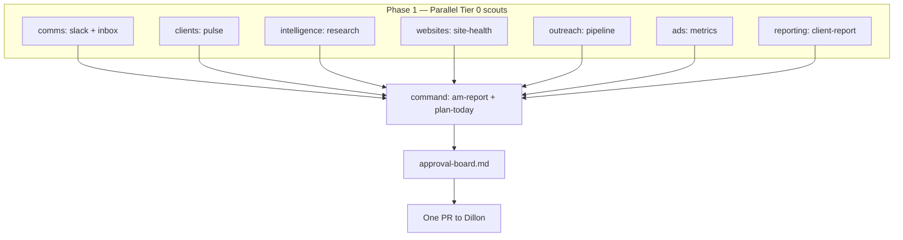

# Dillon Command Center

**Summary:** One umbrella automation with eight parallel lane agents, one commander,
and one approval board — replaces fragmented morning-loop crons.

source: [[00_Inbox/Automation Deep Analysis 2026-07-29]]
contract: [[11_Agents/64gb Morning Orchestrator Spec 2026-07-08]]
handoff: [[11_Agents/Next Codex 64GB Orchestrator Handoff 2026-07-08]]

## The problem

Dillon OS accumulated **dozens of overlapping automations** instead of one system:

| Fragment | What it did | Status |
| --- | --- | --- |
| Morning loop cron | slack-intake → am-report → client-pulse (3 steps) | Superseded |
| Daily-orchestrator PRs (#171–#260) | 30+ duplicate umbrella attempts | Close duplicates |
| Site health sentinel | Daily property checks | Lane: websites |
| Prospect radar / qualify | Outreach pipeline | Lane: outreach |
| Grok/xAI intelligence | Daily research ingest | Lane: intelligence |
| Metrics pull | Vault vitals | Lane: ads |
| Codex 64GB lanes A–H | Desktop command center | Mapped below |
| King Agent OS (legacy) | Old daily command layer | Patterns ported |

## Competitive tasks (three targets)

Every cycle serves the same three written targets from
[[System/OS Config|OS Config]] and [[00_Inbox/Top 15 Opportunities 2026-07-02]]:

1. **ROAD TO 100 CLIENTS** — 12/100 active (Momentum 360 + direct)
2. **$40K Mohr Media in 5 months** — hiring-signal + cold outreach lane
3. **2,000 book subscribers in 4 months** — IMMOHRTAL site + content pipeline

### Task families mapped to lanes

| Competitive task | Lane | Primary skill/CLI |
| --- | --- | --- |
| Boss/client Slack asks | comms | `/slack-intake` |
| Inbox triage | comms | `/inbox-brief` |
| Client stalls + due dates | clients | `/client-pulse` |
| Stale research refresh | intelligence | `/research-sweep` |
| Dead forms / SSL / tracking | websites | `site-health.js` |
| Mac's site-factory pipeline | outreach | `/site-factory`, qualify queue |
| Ads account readiness | ads | `/metrics-pull` |
| Client report delivery | reporting | `/client-report` |
| Morning briefing + plan | command | `/am-report`, `/plan-today` |

### Open signals (2026-08-13)

- 4 Slack requests `status:new` in `00_Inbox/slack/` (frozen 2026-07-30 mirror; live Slack needs MCP)
- Book site `/api/dossier-leads` dead — site-health sentinel should flag
- Activate gates blocked: `netlify_deploy_token`, `mail_vendor` pending
- Codex session history on 64GB desktop not in Git — recovery source only

## Architecture

## How to run

**Skill:** `.claude/skills/dillon-command/SKILL.md`
**CLI:** `node _os/automation/bin/dillon-command.js --agent-mode`
**Profile:** `_os/automation/profiles/dillon-command.json`
**Registry:** `12_Brain/registry/automations.json` id `dillon-command`
**Artifacts:** `automation-runs/dillon-command/YYYY-MM-DD/`
**Cron:** `handoffs/Morning Loop Scheduled Agent Setup.md` (updated prompt)

## Codex lane mapping

| Dillon lane | Codex lane | Agent on 64GB |
| --- | --- | --- |
| comms | B — Gmail/Slack | Comms Scout |
| clients | F — M360 reporting | Client Pulse |
| intelligence | A — Command/memory | Intel Scout |
| websites | D — Landing pages | Site Health |
| outreach | E — Netlify/static | Outreach Scout |
| ads | C — Paid media | Ads Scout |
| reporting | F — Client delivery | Reporting Scout |
| command | H — King Agent/money runs | Commander |

## Related

- [[12_Brain/entities/King Agent OS|King Agent OS]] — predecessor patterns
- [[12_Brain/entities/Codex Workspace (Legacy)|Codex Workspace]] — session history host
- [[11_Agents/Master Agent|Master Agent]] — commander role
- [[12_Brain/protocols/approval-tiers|approval-tiers]] — tier definitions
