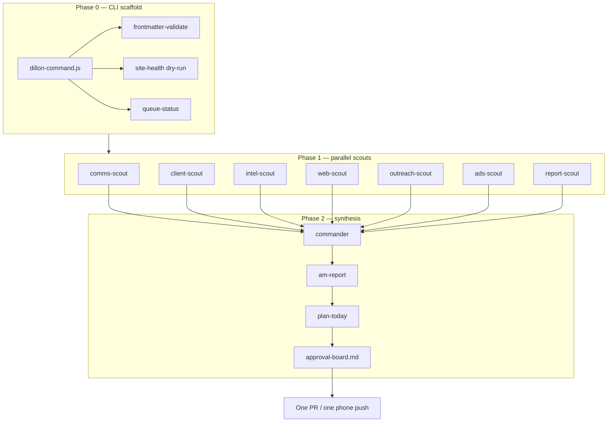

# Dillon Command Center

**Summary:** one umbrella daily workflow — parallel lane scouts, one approval board,
one push — replacing fragmented morning automations and duplicate orchestrator PRs.

## The problem it solves

Dillon OS accumulated separate automations: morning Slack intake, AM report, client
pulse, site health, Grok ingest, prospect radar, maker/checker gates, and dozens of
duplicate `daily-orchestrator` cloud-agent PRs. Codex sessions on the 64GB machine
already defined eight lanes (A–H) but the portable skill runtime lived outside the
vault. This concept unifies them under one contract.

## Architecture

## Lane map (Codex → vault)

| Codex lane | Command lane | Primary skills |
|------------|--------------|----------------|
| A Command | command | `/am-report`, `/plan-today` |
| B Gmail/Slack | comms | `/slack-intake`, `/inbox-brief` |
| C Paid media | ads | `/metrics-pull` + Google Ads Agent |
| D Websites | websites | `/site-grade`, site-health CLI |
| F Reporting | reporting, clients | `/client-report`, `/client-pulse` |
| H King Agent | intelligence | Grok registry + `/research-sweep` |
| Mac pipeline | outreach | `/site-factory`, qualify registry |

## Executable surface

- Profile: `_os/automation/profiles/dillon-command.json`
- CLI: `node _os/automation/bin/dillon-command.js --agent-mode`
- Skill: `/dillon-command`
- Run artifacts: `automation-runs/dillon-command/YYYY-MM-DD/`
- Registry id: `dillon-command` in `12_Brain/registry/automations.json`

## Approval tiers

Mirrors [[12_Brain/protocols/approval-tiers|approval-tiers]] and
[[11_Agents/64gb Morning Orchestrator Spec 2026-07-08|64gb Morning Orchestrator Spec]].

## What stays outside the umbrella

- **Prospect radar** (`radar-morning.ps1`) — requires local Chromium; feeds outreach lane
- **Material website builds** — maker/checker + AEO gate per build, not daily
- **Tier-2 outbound** — always human-gated regardless of orchestrator

## Related

- [[11_Agents/Master Agent|Master Agent]] — commander role
- [[11_Agents/Next Codex 64GB Orchestrator Handoff 2026-07-08|Codex 64GB handoff]]
- [[00_Inbox/Automation Deep Analysis 2026-07-29|Automation Deep Analysis]]
- [[04_SOPs/Communication Intelligence Ingestion|Communication Intelligence Ingestion]]
