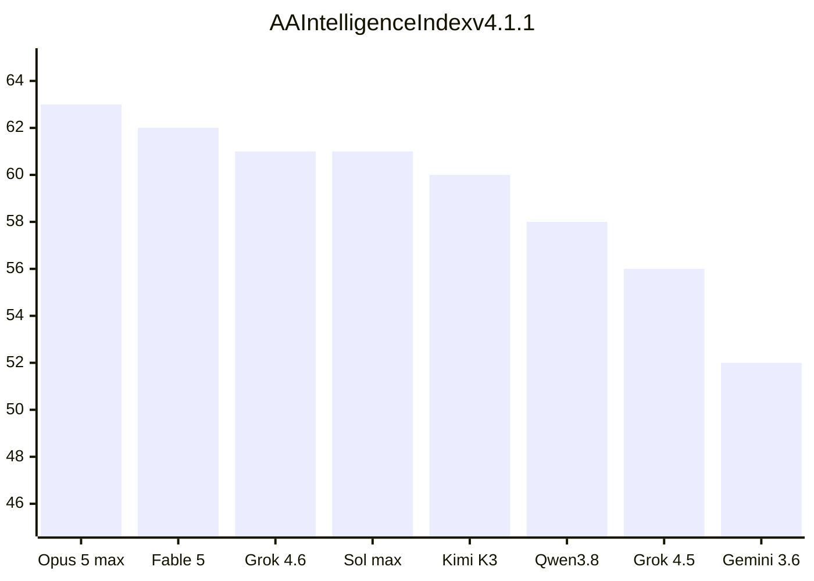

# Grok 4.6 Frontier Comparison

**Summary:** Grok 4.6 is a same-price agent upgrade over Grok 4.5 — Artificial Analysis Index 56→61 — tied with GPT-5.6 Sol Max, still behind Claude Opus 5 Max.

> Cursor mobile cannot preview HTML. **This page is the dashboard.** Desktop browser: `grok-46-dashboard/index.html`. Snapshot **2026-08-12**. Expires **2026-11-10**.

Green-style rows below are **Artificial Analysis** (independent). Orange-style notes are **vendor-compiled** (xAI launch/card, peers from other labs’ cards). Terminal-Bench **v2.1** (AA, 88.4%) is not Terminal-Bench **v3.0** (vendor, 26%).

## Score strip

| | Grok 4.6 High | Grok 4.5 High | Delta |
|---|---:|---:|---|
| AA Intelligence Index | **61** | 56 | +5 |
| vs Grok 4.3 | +23 | — | AA article |
| AA $/task | $0.84 | $0.36 | more thinking tokens |
| Output speed | 78 t/s | 57 t/s | faster decode |
| Time to first token | 42.09s | 9.32s | slower first token |
| Context | 500k | 500k | unchanged |
| API in/out (1M, &lt;200k prompt) | $2 / $6 | $2 / $6 | cache $0.50 vs $0.30 |

## vs Grok 4.5

Headline price did not move. Context did not move. Intelligence, agent scores, and decode speed did.

| What | 4.5 High | 4.6 High | Read it as |
|---|---:|---:|---|
| AA Index | 56 | **61** | Back on the frontier. Not #1. |
| GDPval-AA Elo | 1526 | **1753** | Second behind Opus 5 (1849). |
| AA-Briefcase Elo | 1313 | **1577** | Fable-tier; ~53 turns vs ~103 for Opus 5 max. |
| τ³-Banking | — | **50.7%** | Top two with Qwen3.8 Max (51.3%). |
| Terminal-Bench v2.1 | — | **88.4%** | AA Index suite. With the leaders. |
| CursorBench 3.2 | 66.7% | 69.9% | Vendor. Fable 70.5%. |
| DeepSWE v1.1 | 54% | 65.9% | Vendor. Opus 74% / Sol 73%. |
| FrontierCode Ext. | 56.6% | 61.3% | Vendor. Fable **64.9%** on the card (launch table printed 63.6% — Opus’s number). |
| APEX-Agents | 47.1% | 57.5% | Vendor. Opus 60.6%. |
| Terminal-Bench v3.0 | 15.7% | 26% | Vendor. Opus 43.5% / Sol 34.6%. |
| SWE-Marathon | 29.4% | 31.9% | Vendor. Opus 50%. Still a hole. |

Vendor-only (not scored): longer supplemental training, 4.5-regenerated SFT, more self-testing, stronger first visual/interactive passes, RL for kernels / web / CAD. Ships in Cursor, Grok Build, API, OpenRouter, Vercel, Cloudflare. **Not** on consumer Grok/X at launch.

## Independent AA Index — the field

As of 2026-08-12, Intelligence Index v4.1.1. Grok 4.6 is the **61** row with SpaceXAI. Opus 5 max is first at 63. Do not print a single world rank — AA’s Grok page says #6/183, the leaderboard FAQ says 144 ranked.

| Model | Lab | AA Index | $/task | tok/s | TTFT s | Context |
|---|---|---:|---:|---:|---:|---|
| Claude Opus 5 (max) | Anthropic | **63** | $2.34 | 55 | 52.35 | 1M |
| Claude Opus 5 (xhigh) | Anthropic | **63** | $1.80 | 54 | 23.83 | 1M |
| Claude Fable 5 (with fallback) | Anthropic | 62 | $3.14 | 63 | 99.62 | 1M |
| Claude Opus 5 (high) | Anthropic | 61 | $1.23 | 54 | 12.57 | 1M |
| GPT-5.6 Sol (max) | OpenAI | 61 | $1.23 | 62 | 153.87 | 1M |
| **Grok 4.6 (high)** | SpaceXAI | **61** | **$0.84** | **78** | 42.09 | 500k |
| Kimi K3 (max) | Kimi | 60 | $0.84 | 41 | 2.84 | 1.05M |
| GPT-5.6 Sol (xhigh) | OpenAI | 59 | $0.81 | 61 | 43.35 | 1M |
| Claude Opus 5 (medium) | Anthropic | 59 | $0.72 | 54 | 6.84 | 1M |
| Qwen3.8 Max | Alibaba | 58 | $1.13 | 47 | 2.75 | 1M |
| GPT-5.6 Sol (high) | OpenAI | 57 | $0.55 | 56 | 15.73 | 1M |
| Muse Spark 1.2 (xhigh) | Meta | 57 | $0.40 | — | — | 1.05M |
| GPT-5.6 Terra (max) | OpenAI | 57 | $0.51 | 119 | 164.01 | 1M |
| Grok 4.5 (high) | SpaceXAI | 56 | $0.36 | 57 | 9.32 | 500k |
| GPT-5.6 Sol (medium) | OpenAI | 56 | $0.37 | 57 | 5.75 | 1M |
| Claude Sonnet 5 (max) | Anthropic | 55 | $1.72 | 73 | 188.91 | 1M |
| GPT-5.6 Terra (xhigh) | OpenAI | 53 | $0.31 | 108 | 29.77 | 1M |
| GLM-5.2 (max) | Z AI | 53 | $0.31 | 124 | 1.51 | 1M |
| GPT-5.6 Luna (max) | OpenAI | 52 | $0.05 | 153 | 132.71 | 1M |
| DeepSeek V4 Flash 0731 (max) | DeepSeek | 52 | $0.03 | 125 | 1.43 | 1M |
| Gemini 3.6 Flash | Google | 52 | $0.56 | 234 | 17.76 | 1M |
| Gemini 3.1 Pro Preview | Google | 48 | $0.33 | 115 | 32.87 | 1M |
| MiniMax-M3 | MiniMax | 45 | $0.14 | 83 | 1.57 | 1M |
| DeepSeek V4 Pro (max) | DeepSeek | 45 | $0.05 | 76 | 1.68 | 1M |
| Mistral Medium 3.5 | Mistral | 30 | $0.46 | 119 | 2.49 | 256k |
| Command A+ | Cohere | 23 | $0.00 | 184 | 0.40 | 192k |
| Amazon Nova 2.0 Pro Preview (medium) | Amazon | 22* | — | 117 | 16.18 | 256k |
| Llama 4 Maverick | Meta | 14 | $0.04 | 131 | 1.03 | 1M |
| Llama 4 Scout | Meta | 10 | $0.01 | 122 | 0.84 | 10M |

\* = AA-preliminary. Open-weights lead: **Kimi K3 (60)**. Full HTML filter (60+ rows, lab chips) is `grok-46-dashboard/index.html` on desktop.

## Two ledgers

### Independent AA (trust these first)

| Eval | Grok 4.6 | Best other | Note |
|---|---:|---|---|
| AA Index | 61 | Opus 5 max 63 | Tie with Sol max / Opus 5 high |
| GDPval-AA Elo | 1753 | Opus 5 1849 | Overlaps Fable / Qwen3.8 Max CIs |
| AA-Briefcase Elo | 1577 | Opus 5 1715 | Fable 1574 |
| τ³-Banking | 50.7% | Qwen3.8 Max 51.3% | Top two |
| Terminal-Bench v2.1 | 88.4% | leaders | AA Index suite — not v3.0 |

### Vendor-compiled coding (label it)

| Eval | Grok 4.6 | Grok 4.5 | Opus 5 | Sol max | Fable 5 |
|---|---:|---:|---:|---:|---:|
| CursorBench 3.2 | 69.9% | 66.7% | — | 67.2% | 70.5% |
| DeepSWE v1.1 | 65.9% | 54% | 74% | 73% | 70% |
| FrontierCode Ext. | 61.3% | 56.6% | 63.6% | 60.6% | 64.9% |
| APEX-Agents | 57.5% | 47.1% | 60.6% | 56.7% | 59.2% |
| APEX-SWE | 56.4% | 53.6% | 63.7% | — | 58.8% |
| Terminal-Bench v3.0 | 26% | 15.7% | 43.5% | 34.6% | 34.1% |
| SWE-Marathon | 31.9% | 29.4% | 50% | 42.5% | 45% |

Harvey LAB is omitted — vendor-only, not independently confirmed.

## Buyer’s row

| Model | AA Index | AA $/task | tok/s | Context | API in/out (1M) |
|---|---:|---:|---:|---|---|
| **Grok 4.6 (high)** | 61 | $0.84 | 78 | 500k | $2 / $6 |
| Grok 4.5 (high) | 56 | $0.36 | 57 | 500k | $2 / $6 |
| Claude Opus 5 (max) | 63 | $2.34 | 55 | 1M | $5 / $25 |
| Claude Fable 5 | 62 | $3.14 | 63 | 1M | $10 / $50 (directional) |
| GPT-5.6 Sol (max) | 61 | $1.23 | 62 | 1M | $5 / $30 |
| Kimi K3 (max) | 60 | $0.84 | 41 | 1.05M | open weights |
| Gemini 3.6 Flash | 52 | $0.56 | 234 | 1M | — |

Grok 4.6 long-context band (≥200k prompt) doubles the whole request to $4 / $12. Fast variant is 2× per the launch post.

## Honest gaps

- **Not #1.** Opus 5 max/xhigh 63, Fable 62, then the 61-tie. Do not say “world’s third-best.”
- **Long-horizon repos still trail.** SWE-Marathon 31.9% vs Opus 50%. Terminal-Bench v3.0 26% vs 43.5% / 34.6%.
- **DeepSWE v1.1** 65.9% vs Opus 74% / Sol 73% (vendor-compiled peers).
- **500k context** vs 1M on Opus / Sol / Gemini / Kimi. Same window as 4.5.
- **Cache is dearer than 4.5** ($0.50 vs $0.30). Cost per AA task rose $0.36 → $0.84.
- **Consumer Grok/X later.** Cursor / Grok Build / API today.
- Do not quote an exact parameter count. Do not mix Terminal-Bench versions.

## Links

- Desktop HTML: `grok-46-dashboard/index.html`
- [[12_Brain/concepts/Research Verification Loop|Research Verification Loop]]
- [[12_Brain/concepts/Evidence Boundaries in Reporting|Evidence Boundaries in Reporting]]
- Sources: [xAI launch](https://x.ai/news/grok-4-6) · [model card](https://media.x.ai/v1/website/card-7f81d41b.pdf) · [AA Grok 4.6](https://artificialanalysis.ai/models/grok-4-6) · [AA leaderboard](https://artificialanalysis.ai/leaderboards/models) · [AA analysis](https://artificialanalysis.ai/articles/grok-4-6-benchmarks-and-analysis) · [xAI pricing](https://docs.x.ai/developers/models) · [Cursor](https://cursor.com/blog/grok-4-6)
