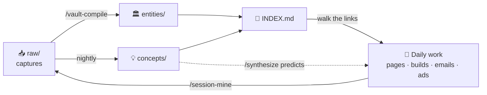

# 🧠 D.I.L.L.O.N. OS

> [!success] ROAD TO 100 CLIENTS
> `██████░░░░░░░░░░░░░░░░░░░░░░░░░░░░░░░░░░░░░░░░░░░░` **~14 / 100**
> Core M360 roster **7** · newer June lanes **7** · in the pipe: **$45k Ecosystem proposal**
> Numbers live in [[System/OS Config|OS Config]] — update `goal_current` there.

> [!tip]- 🗺 Visual views
> - [[Brain Map.canvas|Brain Map]] — the whole system as a canvas
> - [[Clients.base|Clients]] — sortable Active / Former tables
> - Graph view is color-coded: 🟢 clients · 🟣 concepts · 🔵 entities · 🟡 raw · 🟠 SOPs

## Quick Links

> [!example] Navigate
> [[INDEX|🧠 Brain Index]] · [[01_Clients/Client Index|🤝 Clients]] · [[04_SOPs/SOP Index|🔧 SOPs]] · [[02_Campaigns/Campaign Index|📣 Campaigns]] · [[03_Content/Content Index|✍️ Content]] · [[00_Inbox/Start Here|📥 Inbox]] · [[System/Second Brain Ops|🔁 Ops]] · [[10_Sessions/Session Index|🛠 Sessions]] · [[05_Offers/Offer Index|💼 Offers]] · [[06_Personal/Personal Index|🏠 Personal]]

## How the brain works

## Today

- [ ] Check [[00_Inbox/Open Threads from Intel Core 7 Brief|open delivery threads]]
- [ ] Review active campaigns
- [ ] Follow up with clients

## Active Projects

> [!todo] Delivery board
> - **AMI website** — locked homepage build ready; blocked on Bluehost access
> - **7-Eleven LPs** — match Pompano shell before launch; fix Kwik Trip #633 destination
> - **Zen Spa** — booking widget down; Boulevard access chase
> - **Revive** — page edits queued behind GHL access
> - **Ecosystem ($45k)** — proposal out to Tori

## Notes

- 
