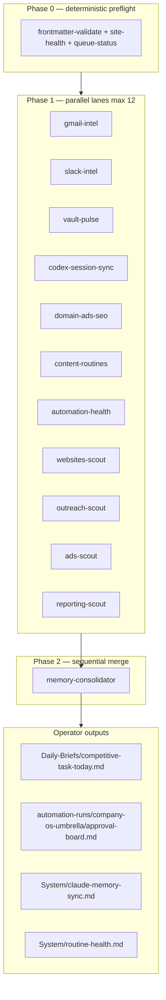

# Competitive Task Definition

## What it is

Dillon's **competitive task** is operator throughput: run paid media, web, SEO,
and comms for the active client roster plus Align HCM (full-time) and Mohr Media
(build lane) without dropping launches, billing, or client replies.

The edge is not more schedulers — it is **one umbrella workflow** that fans out
parallel intel lanes, then one consolidator writes a single daily brief and
approval board. Codex/Marketing Chief remains the sole orchestrator for
execution; this automation is daily sensing and priority stacking, not a second
command center.

## Success criteria

1. **Nothing launch-blocking sits silent** (landing pages, ad disapprovals, broken tracking).
2. **Billing risk surfaced before pause** (engagement, card, invoice signals).
3. **Urgent replies** have an owner and next action in `System/urgent-replies.md`.
4. **Vault stays truthful** — `last_touched`, `next_action`, `due` on active client notes.
5. **One brief to open** — `Daily-Briefs/competitive-task-today.md` each run.
6. **Automation health visible** — local schedulers and Claude loop state surfaced, not assumed green.

## P0 tie-break (when everything screams)

1. Launch blocked (client waiting on you)
2. Billing / engagement at risk
3. Ad disapprovals / account health
4. Hard calendar commitments (calls, meetings)
5. Stale canonical truth (wrong roster, wrong client route)

## Umbrella architecture

| Phase | Mode | Agents |
|-------|------|--------|
| 0 | Parallel CLIs | frontmatter-validate, site-health, queue-status |
| 1 | Parallel (same turn) | gmail-intel, slack-intel, vault-pulse, codex-session-sync, domain-ads-seo, content-routines, automation-health, websites-scout, outreach-scout, ads-scout, reporting-scout |
| 2 | Sequential | memory-consolidator |

Subagent definitions: `.cursor/agents/*.md`  
Automation prompt: `System/company-os-umbrella-prompt.md`  
Runbook: `04_SOPs/company-os-umbrella.md`  
CLI scaffold: `node _os/automation/bin/dillon-command.js --profile company-os-umbrella`

## Sources of truth

| Source | Path / tool | Lane |
|--------|-------------|------|
| Obsidian vault | This repo | vault-pulse, domain-ads-seo |
| Gmail | Gmail MCP when connected | gmail-intel |
| Slack | Slack MCP when connected | slack-intel |
| Codex / Cursor sessions | `10_Sessions/`, `11_Agents/` rollouts | codex-session-sync |
| Cross-instance memory | `System/claude-memory-sync.md` | memory-consolidator |
| Local automation state | `12_Brain/queue/claude-loop-*.jsonl`, `System/routine-health.md` | automation-health |
| Operating truth | `System/operating-status.md`, `System/approval-queue.md` | memory-consolidator |

## Retired standalone automations (merged into umbrella)

These legacy Cursor crons and morning-loop fragments are **superseded** by
`company-os-umbrella`:

- `nightly-client-pulse` → vault-pulse
- `gmail-to-vault-digest` → gmail-intel
- `vault-integrity-sync` → memory-consolidator
- `chat-to-vault-sync` → codex-session-sync
- `bok-law-social-content` → content-routines (Sunday)
- `linkedin-growth-engine` → content-routines (Sunday)
- `book-site-seo-sweep` → content-routines (Thursday)
- Separate `dillon-command` morning cron → same umbrella (one run)
- Separate `competitive-task-orchestrator` afternoon cron → same umbrella

**Single Cursor replacement:** `company-os-umbrella` — cron `0 13 * * *` (1:00 PM
America/New_York daily) or on-demand.

## Coordinated local layer (not replaced — surfaced)

The umbrella does not run Windows Task Scheduler or Codex cron jobs. It **reads**
their artifacts and reports lane health:

| Local scheduler | Cadence | Surfaced by |
|-----------------|---------|-------------|
| `Claude-Autonomous-Daily-Driver` | Every 15 min | automation-health |
| `DillonAgentOS-GmailBridge` / `-SlackBridge` | ~15 min | gmail-intel / slack-intel fallback |
| `Prospect Radar - Next 20` | Daily 5:20 AM ET | outreach-scout |
| Codex cron automations (12 active) | Various | automation-health |
| `Invoke-ClaudeLoop` receipts | Per routine | automation-health |
| 64GB morning orchestrator (when enabled) | ~7:00 AM ET | reads same approval board artifact |

Execution authority stays with Codex/Marketing Chief and the 54-routine operating
team (`11_Agents/claude-operating-team.json`). The umbrella produces the
priority stack and approval board; Codex executes on approval.

## Operator rules (non-negotiable)

- **KJB emails** CC: mjfrederick334@gmail.com, sean@needmomentum.com, melissarobinn@gmail.com
- **Align HCM** is full-time employer — not M360 client revenue
- **Commercial Cleaners Alliance** — Momentum 360 brand on client-facing sends
- No send, publish, deploy, spend, or account mutation from this automation
