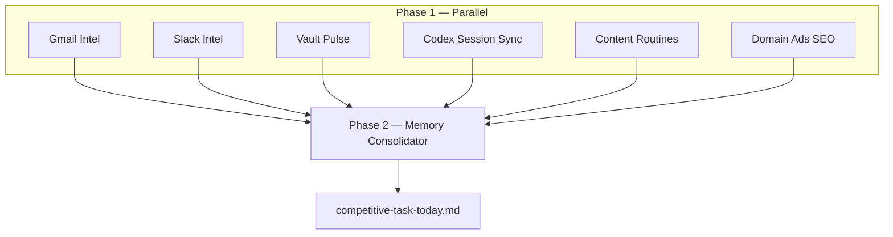

# Competitive Task Orchestrator

Single umbrella automation for **Dillon OS**. Replaces seven separate cron automations with one daily run that fans out parallel specialist agents, then merges results into the vault.

## What “competitive task” means here

Not SEO keyword competition alone. It is the **daily operator race**: clients, inbox, Slack, vault state, Codex/session notes, deliverables, and competitive positioning intel must stay aligned before competitors (or clients) get ahead of you.

Sources of truth:

| Source | Agent | Vault outputs |
|--------|--------|----------------|
| Gmail | [[11_Agents/Gmail Intel Agent\|Gmail Intel]] | `System/urgent-replies.md`, client `## Gmail intel` sections |
| Slack | [[11_Agents/Slack Intel Agent\|Slack Intel]] | `System/slack-pulse.md`, client notes |
| Vault + clients | [[11_Agents/Vault Pulse Agent\|Vault Pulse]] | `Daily-Briefs/pulse-today.md`, stalled/due detection |
| Codex / Cursor sessions | [[11_Agents/Codex Session Sync Agent\|Codex Session Sync]] | `10_Sessions/`, `System/claude-memory-sync.md` |
| Content cadences | [[11_Agents/Content Routines Agent\|Content Routines]] | BOK Law, Align LinkedIn, book SEO |
| Ads / SEO / competitive gaps | [[11_Agents/Domain Ads SEO Agent\|Domain Ads SEO]] | `03_Content/`, client reporting logs, competitor notes |
| Merge | [[11_Agents/Memory Consolidator Agent\|Memory Consolidator]] | `Daily-Briefs/competitive-task-today.md`, memory sync |

## Legacy automations (retire these crons)

| Legacy cron | Absorbed by |
|-------------|-------------|
| `nightly-client-pulse` | Vault Pulse |
| `gmail-to-vault-digest` | Gmail Intel |
| `vault-integrity-sync` | Memory Consolidator |
| `chat-to-vault-sync` | Codex Session Sync |
| `bok-law-social-content` | Content Routines (Sunday branch) |
| `linkedin-growth-engine` | Content Routines (Sunday branch) |
| `book-site-seo-sweep` | Content Routines (Thursday branch) |

Disable the legacy Cursor automations after the umbrella run is verified for three consecutive days.

## Schedule

- **Cron:** `0 13 * * *` (1:00 PM UTC daily — matches automation `bc523644-815a-43a9-b434-fd2967c1be2c`)
- **Name:** `competitive-task-orchestrator`
- **Repo:** This vault (Obsidian / Dillon OS)
- **Prompt file:** [[System/competitive-task-orchestrator-prompt]]

## Execution model

Phase 1 agents must not block each other. Phase 2 reads all Phase 1 outputs and writes the daily brief plus `System/claude-memory-sync.md`.

## Priority stack (P0 → P3)

Use this when the consolidator must cut scope:

1. **P0 — Launch / billing / disapprovals:** NKCDC blocked launch, Hardwood Artisan billing, Bar Crawl ad disapprovals
2. **P1 — Calendar / same-day replies:** Teams invites, direct client asks, M360 leadership threads
3. **P2 — Deliverables due ≤48h:** Creative commitments, weekly content, reports
4. **P3 — Growth / SEO / competitive scans:** LinkedIn calendar, book SEO, competitor gap notes

## Operator rules (non-negotiable)

- **KJB emails:** CC `mjfrederick334@gmail.com`, `sean@needmomentum.com`, `melissarobinn@gmail.com`
- **Align HCM:** Full-time employer — never counted in M360 client revenue totals
- **Contact truth:** Prefer Gmail thread participants over stale client note contacts (e.g. CCA → Mike Ross, not assumed David Stemm)

## MCP / tools required

Enable on the automation:

- Gmail search (read-only)
- Slack (read channels/DMs configured in integration)
- Git push to vault branch
- Memories (AutomationMemory)

## Verification checklist

After each run, confirm:

- [ ] `Daily-Briefs/competitive-task-today.md` dated today
- [ ] `System/urgent-replies.md` `last_updated` is today
- [ ] At least one client note got `last_touched` if email activity existed
- [ ] No duplicate sections contradicting `System/claude-memory-sync.md`

## Related

- [[11_Agents/Agent Index]]
- [[System/routine-health]]
- [[Dashboard]]
