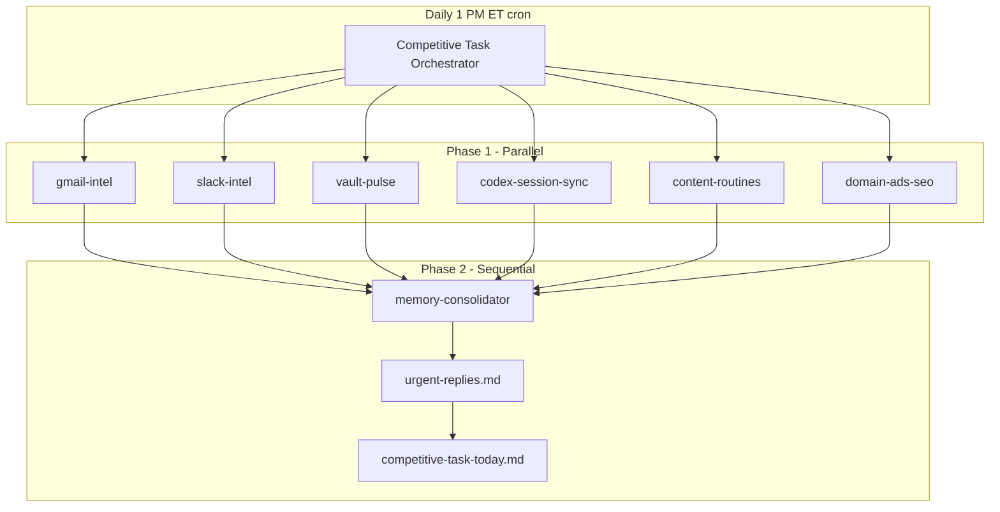

# Competitive Task Workflow (Umbrella)

One automation replaces seven cron jobs. Parallel agents gather intel; one consolidator writes the vault.

## Architecture

## What “competitive task” means here

The tasks **competing for Dillon's attention today** across:

| Source | Former automation | Subagent |
|--------|-------------------|----------|
| Gmail | `gmail-to-vault-digest` | `gmail-intel` |
| Slack | (manual) | `slack-intel` |
| Obsidian vault | `nightly-client-pulse` | `vault-pulse` |
| Codex / Cursor / Claude chats | `chat-to-vault-sync` | `codex-session-sync` |
| Memory file | `vault-integrity-sync` | `memory-consolidator` |
| BOK / LinkedIn / Book SEO | 3 Sunday/Thursday crons | `content-routines` |
| Ads & SEO queues | (implicit in pulse) | `domain-ads-seo` |

## Files

| File | Role |
|------|------|
| [[System/competitive-task-orchestrator-prompt]] | Paste into Cursor automation UI |
| [[AGENTS]] | Cloud agent repo instructions |
| `.cursor/agents/*.md` | Subagent definitions |
| [[Daily-Briefs/competitive-task-today]] | **Read this every morning** |
| [[System/claude-memory-sync]] | SSOT for all AI instances |
| [[System/urgent-replies]] | Email urgency rollup |
| [[11_Agents/Master Agent]] | Human-readable delegation map |

## Setup checklist

1. Cursor automation: cron `0 13 * * *`, attach **this repo**, paste orchestrator prompt.
2. Enable MCP: Gmail (required), Slack (recommended), Memories (required).
3. Disable or archive old automations listed in `replaces` frontmatter above.
4. First run: verify `Daily-Briefs/competitive-task-today.md` updates and git commit lands.

## Deprecation notice

Do **not** schedule these as separate automations anymore:

- `nightly-client-pulse`
- `gmail-to-vault-digest`
- `vault-integrity-sync`
- `chat-to-vault-sync`
- `bok-law-social-content`
- `linkedin-growth-engine`
- `book-site-seo-sweep`

`System/routine-health.md` tracks health of the umbrella only.

## Related

- [[Dashboard]]
- [[10_Sessions/Automation Debug Log]]
- [[01_Clients/Client Index]]
