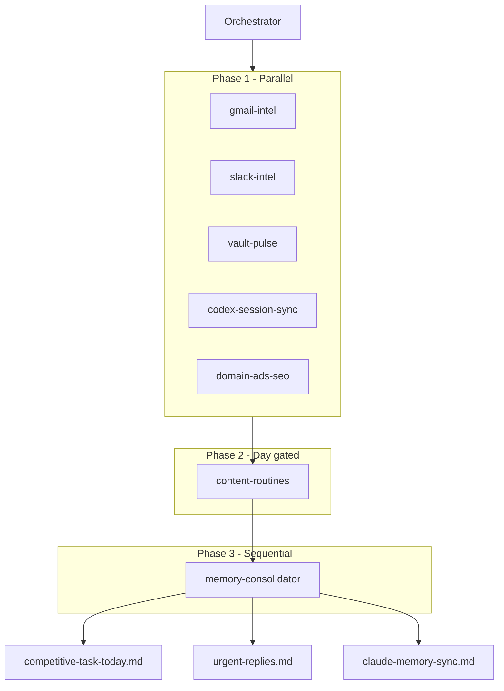

# Competitive Task Workflow

## What “competitive task” means here

Not competitive analysis. This is **operator throughput**: staying ahead across ~25 M360/direct clients, Align HCM (full-time), Mohr Media build work, and all inbound channels without dropping balls.

The competitive edge is **one umbrella system** (this vault + one daily orchestrator) with **parallel intel lanes**, not seven disconnected Cursor crons fighting for context.

## Umbrella automation

| Field | Value |
|-------|-------|
| Automation name | `competitive-task-orchestrator` |
| Cron | `0 13 * * *` (1:00 PM ET daily) |
| Prompt source | `System/competitive-task-orchestrator-prompt.md` |
| Copy-paste variant | `.cursor/automation/competitive-task-orchestrator.md` |
| Daily output | `Daily-Briefs/competitive-task-today.md` |
| SOP | `04_SOPs/competitive-task-orchestrator.md` |
| Subagents | `.cursor/agents/dillon-*.md` |

## Retired routines (do not re-enable)

These are **merged** into the umbrella. Disable them in Cursor Automations after three green orchestrator runs:

1. `nightly-client-pulse` → `dillon-vault-pulse`
2. `gmail-to-vault-digest` → `dillon-gmail-intel`
3. `vault-integrity-sync` → `dillon-memory-consolidator`
4. `chat-to-vault-sync` → `dillon-codex-session-sync`
5. `bok-law-social-content` → `dillon-content-routines` (Sunday)
6. `linkedin-growth-engine` → `dillon-content-routines` (Sunday)
7. `book-site-seo-sweep` → `dillon-content-routines` (Thursday)

## Execution graph

## P0 tie-break (when ranking actions)

1. Launch blocked (e.g. NKCDC landing page)
2. Billing / card risk (e.g. Hardwood Artisan)
3. Ad disapprovals (e.g. Bar Crawl USA)
4. Hard calendar commitments (calls, creative delivery dates)

## Operator rules (non-negotiable)

- KJB emails **always** CC: mjfrederick334@gmail.com, sean@needmomentum.com, melissarobinn@gmail.com
- Align HCM is **full-time**, not M360 client revenue. Never M360 branding on Align output.
- Bar Crawl USA: pre-approved copy only; no alcohol language.
- Fresh Blends: use **Replenish** branding.

## MCP requirements

Live runs need **Gmail** and **Slack** MCP on the automation runner. Without them, subagents fall back to vault files (`System/urgent-replies.md`, client `## Gmail intel` sections, `10_Sessions/`). Mark coverage gaps in the daily brief.

## Routers

- **Master Agent** (`11_Agents/Master Agent.md`): triages work to M360 vs Align vs Mohr Media vs Book.
- **Campaign queues** (`02_Campaigns/*`): ads/SEO execution backlog for `dillon-domain-ads-seo`.
