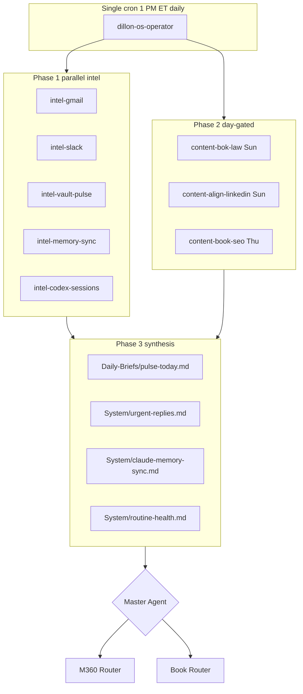

# Dillon OS Operator (umbrella automation)

## Competitive task

**Operator throughput** across ~25 Momentum 360 / direct clients plus Mohr Media build work. The edge is not more crons. It is one vault-backed system with parallel AI lanes that ingest signals, update state, and execute day-gated deliverables without fragmenting attention.

## What this replaces

| Legacy automation | Absorbed into |
| ----------------- | ------------- |
| `nightly-client-pulse` | Phase 1 `intel-vault-pulse` + Phase 3 synthesis |
| `gmail-to-vault-digest` | Phase 1 `intel-gmail` |
| `vault-integrity-sync` | Phase 1 `intel-memory-sync` |
| `chat-to-vault-sync` | Phase 1 `intel-codex-sessions` |
| `bok-law-social-content` | Phase 2 Sunday `content-bok-law` |
| `linkedin-growth-engine` | Phase 2 Sunday `content-align-linkedin` |
| `book-site-seo-sweep` | Phase 2 Thursday `content-book-seo` |

After three consecutive green runs, disable the seven legacy Cursor automations.

## Architecture

## Phase 1 — parallel intel (every run)

Launch all five lanes concurrently via the Task tool. Each lane returns a structured markdown block. Do not run them sequentially.

| Lane | Primary inputs | Vault outputs |
| ---- | -------------- | ------------- |
| `intel-gmail` | Gmail MCP (search unread, client domains, thread age) | Findings only (merged into pulse) |
| `intel-slack` | Slack MCP (DMs, client channels, @mentions) | Findings only |
| `intel-vault-pulse` | `01_Clients/` mtime, frontmatter `due` / `next_action` / `last_touched` | Stalled + due lists |
| `intel-memory-sync` | Client notes, campaign queues, `System/claude-memory-sync.md` | Draft memory sync |
| `intel-codex-sessions` | `10_Sessions/`, Cursor/Codex session exports if present | Open loops + decisions |

Lane prompts live in `.cursor/automation/lanes/`.

## Phase 2 — day-gated content (America/New_York)

| Day | Lanes | Deliverables |
| --- | ----- | ------------ |
| Sunday | `content-bok-law`, `content-align-linkedin` | BOK Law week social → `01_Clients/Bok Law/` draft; Align LinkedIn drafts → `02_FullTimeJob/AlignHCM/` |
| Thursday | `content-book-seo` | Book SEO sweep → `05_Book/seo-strategy.md` progress note + task list |

All content follows `System/writing-rules.md`.

## Phase 3 — synthesis (sequential, after Phase 1 + 2)

1. Write `Daily-Briefs/pulse-today.md` (operator brief for Dillon).
2. Rewrite `System/urgent-replies.md` from intel lanes.
3. Rewrite `System/claude-memory-sync.md` (single source of truth).
4. Touch `last_checked` on `System/routine-health.md`.
5. Append run summary to `10_Sessions/Automation Debug Log.md` on errors or MCP gaps.

## Phase 4 — routing hints (no auto-send)

Master Agent reads the pulse and sets **recommended** delegations only. Nothing sends to clients without human approval.

| Signal type | Router |
| ----------- | ------ |
| M360 client ads, SEO, reports, email | [[11_Agents/M360 Router]] |
| Align HCM employer content | Align lane in Master Agent (not M360 branding) |
| Mohr Media book / personal brand | [[11_Agents/Book Router]] |
| Facebook ads system / API | [[11_Agents/Google Ads Agent]] + [[10_Sessions/Facebook Ads System Build Log]] |

## MCP requirements

| MCP | Used by | Fallback if missing |
| --- | ------- | ------------------- |
| Gmail | `intel-gmail` | Log in Automation Debug Log; use `System/urgent-replies.md` stale data |
| Slack | `intel-slack` | Same |
| Obsidian REST (optional) | Live vault on device | This repo is the vault mirror for cloud runs |

## Success criteria

- `Daily-Briefs/pulse-today.md` dated today with Priority Stack (max 5 items).
- `System/urgent-replies.md` `last_updated` is today.
- `System/claude-memory-sync.md` `last_sync` is today.
- Phase 1 lanes documented as completed or skipped-with-reason in pulse Coverage Notes.
- Sunday/Thursday content lanes run only on correct weekdays.

## Human checklist after each run

1. Skim Priority Stack in pulse.
2. Approve or edit any Sunday/Thursday drafts before client send.
3. Clear resolved items from urgent-replies mentally (file updates next run).
