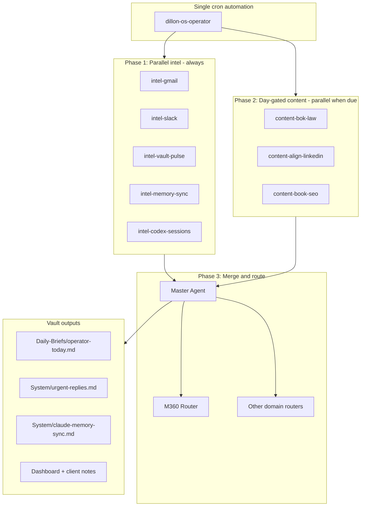

# Dillon OS Operator (Umbrella Workflow)

**One automation. Parallel agents. One vault.**

This replaces seven separate Cursor cron automations with a single daily run: `dillon-os-operator`. The operator reads every signal source (Gmail, Slack, Obsidian vault, Codex/Cursor session history), runs specialist agents in parallel, then writes consolidated outputs back to the vault.

## Competitive task (what this solves)

Dillon's real job is **operator throughput across ~25 accounts** while building **Mohr Media** as a productized growth company. The competitive edge is speed + systems, not more tools. Fragmented automations (pulse here, Gmail there, Bok Law on Sunday, book SEO on Thursday) fight each other for context and miss cross-signals.

The umbrella workflow treats **Dillon OS** (`/workspace` Obsidian vault) as the system of record and runs one orchestrated pass that:

1. Pulls external intel in parallel (mail, Slack, sessions)
2. Reconciles vault state (memory sync, client frontmatter, urgent queue)
3. Runs day-gated content lanes (Bok Law, Align LinkedIn, book SEO)
4. Routes execution work to domain routers (M360, Buzz Bull, Mohr Media, Align HCM, Book)
5. Produces one **Daily Operator Brief** Dillon reads once

## Architecture



## Schedule (inside one automation)

| When | What runs | Old routine name |
| --- | --- | --- |
| Every run (daily 1:00 PM ET cron) | Phase 1 intel agents (all parallel) | nightly-client-pulse, gmail-to-vault-digest, vault-integrity-sync, chat-to-vault-sync |
| Sunday | + content-bok-law, + content-align-linkedin | bok-law-social-content, linkedin-growth-engine |
| Thursday | + content-book-seo | book-site-seo-sweep |
| After merge | Master Agent priority stack + router delegation | (was manual) |

**Disable** the seven legacy Cursor automations once `dillon-os-operator` is verified for three consecutive days.

## Phase 1: Intel agents (always parallel)

Launch these with `/multitask` or Cursor async subagents. Each agent owns **disjoint output files** to avoid merge conflicts.

| Agent | Reads | Writes |
| --- | --- | --- |
| `intel-gmail` | Gmail MCP: client contacts from `01_Clients/m360-master-contacts.md`, unread threads, 48h window | Sections in `Daily-Briefs/operator-today.md`, updates `System/urgent-replies.md` |
| `intel-slack` | Slack MCP (Momentum/Buzz Bull channels if connected) | Slack section in `operator-today.md`, flags in `urgent-replies.md` |
| `intel-vault-pulse` | `01_Clients/**` mtime, `last_touched`, `due`, `next_action` frontmatter | Active clients, stalled items, deliverables in `operator-today.md` |
| `intel-memory-sync` | All client `overview.md`, `Agent Memory.md`, prior `claude-memory-sync.md` | Rewrites `System/claude-memory-sync.md` |
| `intel-codex-sessions` | Recent Cursor/Codex transcripts in `10_Sessions/`, automation logs | Session deltas in `operator-today.md`, optional `10_Sessions/` log entry |

## Phase 2: Content agents (day-gated, parallel)

| Agent | Runs on | Reads | Writes |
| --- | --- | --- | --- |
| `content-bok-law` | Sunday | `01_Clients/Bok Law/content-calendar.md`, brand notes | `01_Clients/Bok Law/` weekly assets + calendar update |
| `content-align-linkedin` | Sunday | `02_FullTimeJob/AlignHCM/linkedin-calendar.md` | Draft posts in AlignHCM folder (no M360 branding) |
| `content-book-seo` | Thursday | `05_Book/seo-strategy.md`, rank targets | SEO action items in `05_Book/` + `operator-today.md` |

## Phase 3: Master Agent merge

After Phase 1–2 complete, **Master Agent** (single sequential pass):

1. Read all parallel outputs and `System/claude-memory-sync.md`
2. Deduplicate urgent items (same client in Gmail + Slack + vault → one bullet)
3. Write `Daily-Briefs/operator-today.md` (replaces `pulse-today.md` as canonical brief)
4. Update `Dashboard.md` Today section with top 3 priorities
5. Route actionable work to domain routers (see [[Master Agent]])

## Domain routers (execution, not daily intel)

| Router | Scope |
| --- | --- |
| [[Momentum 360 Router]] | M360 clients from [[Client Index]] |
| Align HCM Router | Full-time employer only |
| Buzz Bull Router | Florecita, NextGen, Coach B, CCA |
| Mohr Media Router | Direct clients |
| Meadow Creek Router | Sally Compton collaborations |
| Book Router | The Ironic Ineptocracy (branch `claude/agent-architecture-design-7oiAe`) |

## Specialist agents (on demand via routers)

| Agent | Vault doc | Cursor subagent |
| --- | --- | --- |
| Google Ads | [[Google Ads Agent]] | `.cursor/agents/google-ads-agent.md` |
| SEO | [[SEO Agent]] | `.cursor/agents/seo-agent.md` |
| Reporting | [[Reporting Agent]] | `.cursor/agents/reporting-agent.md` |
| Web | [[Web Agent]] | `.cursor/agents/web-agent.md` |

## Output template: operator-today.md

```markdown
# Operator Brief YYYY-MM-DD

## Coverage
• Sources scanned: Gmail, Slack, vault, sessions

## Urgent (act today)
• ...

## Client pulse
• ...

## Stalled (7+ days)
• ...

## Content shipped this run
• ...

## Tomorrow priority stack
1. ...
2. ...
3. ...
```

## Cursor automation setup

1. Repo: `dillon-os` branch `cursor/competitive-task-workflow-3836` (or `main` after merge)
2. Trigger: cron `0 13 * * *` (1:00 PM ET daily) — **one** automation
3. Prompt file: `.cursor/automation/dillon-os-operator.md`
4. MCP: Gmail (required), Slack (recommended), Obsidian local REST API if vault is on desktop

## Mohr Media competitive lens

This workflow is the **implementation layer** for Mohr Media's operator positioning: one system that compounds across clients instead of seven brittle cron jobs. Competitive analysis (agency vs course vs DIY tools) lives in `05_Offers/Mohr Media Business Plan.md` Section 21. The operator workflow is how Dillon **runs** that edge daily.

## Verification checklist

- [ ] `operator-today.md` generated with all Phase 1 sections
- [ ] `urgent-replies.md` and `claude-memory-sync.md` updated same run
- [ ] Sunday run produces Bok Law + LinkedIn drafts
- [ ] Thursday run includes book SEO actions
- [ ] Legacy automations disabled
- [ ] `System/routine-health.md` shows green for `dillon-os-operator`
