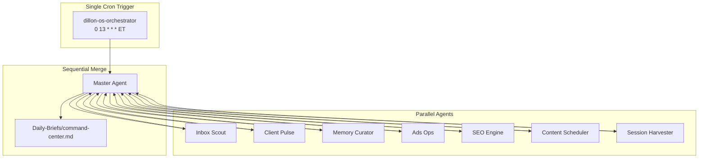

# Dillon OS Orchestrator

One umbrella automation for Dillon OS (this Obsidian vault). It replaces seven separate cron jobs with a single run that launches specialist agents **in parallel**, then merges their outputs into one daily command center.

## Problem this solves

You had overlapping automations doing similar vault scans:

| Legacy routine | Output | Overlap |
| --- | --- | --- |
| `nightly-client-pulse` | `Daily-Briefs/pulse-today.md` | Gmail + client scan |
| `gmail-to-vault-digest` | `System/urgent-replies.md` | Gmail scan |
| `vault-integrity-sync` | `System/claude-memory-sync.md` | Client scan |
| `chat-to-vault-sync` | memory + sessions | Session state |
| `bok-law-social-content` | BOK Law calendar | Content gen |
| `linkedin-growth-engine` | Align HCM LinkedIn calendar | Content gen |
| `book-site-seo-sweep` | Book SEO notes | SEO audit |

Each routine re-read Gmail, re-scanned `01_Clients/`, and fought for "source of truth." The orchestrator runs **once**, fans out parallel agents with clear ownership, and writes a single merged brief.

## Architecture

## Modes

### Full mode (daily, 1:00 PM ET)

Launch all seven specialists via the Task tool (or equivalent parallel subagents). Each agent writes only to its owned files. Master Agent merges into `Daily-Briefs/command-center.md` and updates `System/routine-health.md`.

### Light mode (optional, every 2 hours)

Only **Memory Curator** + **Session Harvester**. Updates `System/claude-memory-sync.md` and appends to `10_Sessions/` when new Codex/Claude/Slack exports appear. No Gmail re-scan.

## Data sources (in priority order)

1. **This vault** — `01_Clients/`, `02_Campaigns/`, `System/`, `Daily-Briefs/`
2. **Gmail** (MCP) — unread threads, client addresses from `01_Clients/m360-master-contacts.md`
3. **Codex / Claude sessions** — `10_Sessions/`, `.claude/`, any chat exports dropped in `00_Inbox/`
4. **Slack** (MCP when available) — DMs and mentions for Momentum 360, Buzz Bull, Align HCM channels
5. **Campaign queues** — `02_Campaigns/*Queue.md`

## Outputs (every full run)

| File | Owner agent |
| --- | --- |
| `System/urgent-replies.md` | Inbox Scout |
| `Daily-Briefs/pulse-today.md` | Client Pulse |
| `System/claude-memory-sync.md` | Memory Curator |
| `Daily-Briefs/command-center.md` | Master Agent (merge) |
| `System/routine-health.md` | Master Agent (status footer) |

## Conditional workstreams

Evaluated at runtime by Master Agent (America/New_York):

| When | Agent | Action |
| --- | --- | --- |
| Sunday ≥ 6:00 PM | Content Scheduler | Generate BOK Law week of social posts |
| Sunday ≥ 9:00 PM | Content Scheduler | Draft next Align HCM LinkedIn slots if calendar gap |
| Thursday | SEO Engine | Book site SEO sweep per `05_Book/seo-strategy.md` |

## Rules (all agents)

Follow [[System/writing-rules|Writing Rules]]. Momentum 360 branding on client comms. Align HCM is never a M360 client.

## How to run

- **Cursor Automation (cron):** Use prompt in [[System/ORCHESTRATOR_PROMPT|ORCHESTRATOR_PROMPT]]
- **Manual:** Open [[11_Agents/Master Agent|Master Agent]] and paste the orchestrator prompt
- **Machine config:** `System/orchestrator-manifest.json`

## Deprecation

Disable these separate automations once `dillon-os-orchestrator` is verified:

- `nightly-client-pulse`
- `gmail-to-vault-digest`
- `vault-integrity-sync`
- `chat-to-vault-sync`
- `bok-law-social-content`
- `linkedin-growth-engine`
- `book-site-seo-sweep`
