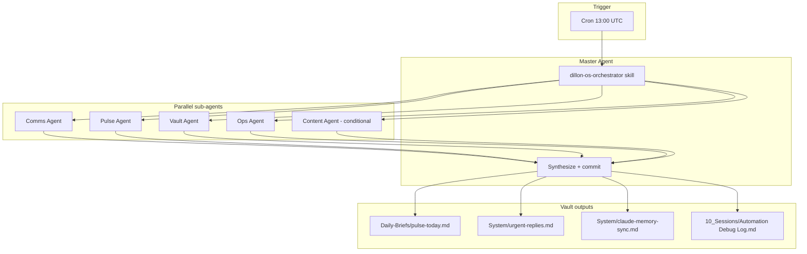

# Dillon OS Orchestrator

One umbrella automation replaces seven legacy Cursor routines. A single cron (`0 13 * * *` UTC) runs the **Master Agent**, which fans out parallel sub-agents and merges results into the vault.

## Competitive task

Your competitive task is **operator throughput under competing client priorities**: dozens of accounts, shared inboxes (M360, Buzz Bull), Align HCM day job, Mohr Media/book growth, and inbound comms. The orchestrator exists so you stop context-switching between separate automations and get **one daily brief + one memory sync + comms triage** per run.

## Architecture

## Sub-agents

| Agent | Repo path | Writes |
|-------|-----------|--------|
| Comms | `.cursor/agents/comms-agent.md` | urgent-replies (via Master) |
| Pulse | `.cursor/agents/pulse-agent.md` | pulse sections (via Master) |
| Vault | `.cursor/agents/vault-agent.md` | claude-memory-sync |
| Ops | `.cursor/agents/ops-agent.md` | pulse Ops section |
| Content | `.cursor/agents/content-agent.md` | BOK / LinkedIn / book files (Sun/Thu) |

Vault-facing copies live in `11_Agents/` for Obsidian navigation.

## Day-of-week schedule

| Day | Content Agent runs |
|-----|-------------------|
| Sunday | BOK Law weekly social + Align HCM LinkedIn lookahead |
| Thursday | Book site SEO sweep |
| Mon–Sat (else) | Only if a client `due:` forces content today |

Comms, Pulse, Vault, and Ops run **every day**.

## Cursor automation setup

1. Open [cursor.com/automations](https://cursor.com/automations).
2. **Disable or delete** the seven legacy automations listed in frontmatter `replaces`.
3. Create one automation:
   - **Repo:** this vault
   - **Schedule:** `0 13 * * *` (matches existing cron)
   - **Prompt:** `Run the dillon-os-orchestrator skill end-to-end. Phase 0 orient, Phase 1 parallel Task fan-out, Phase 2 synthesize, Phase 3 commit.`
   - **Tools:** Memories, Git, Gmail MCP (if connected), Slack MCP (optional)
4. Enable the `dillon-os-orchestrator` skill from `.cursor/skills/`.

## Legacy routine mapping

Do not re-enable separate crons for legacy routine names. If something breaks, fix the sub-agent spec and re-run the umbrella automation.

## Related

- [[11_Agents/Master Agent]]
- [[System/routine-health]]
- [[System/claude-memory-sync]]
- [[Dashboard]]
