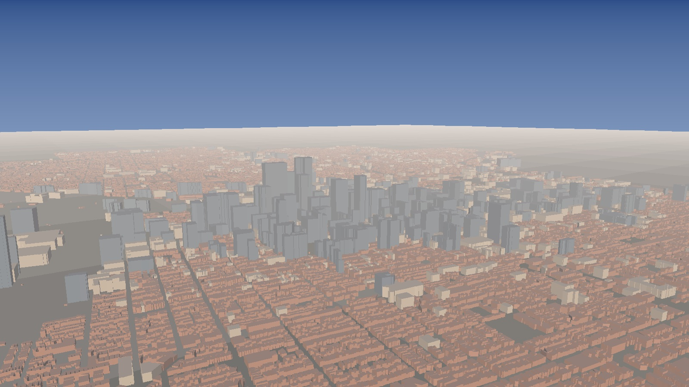

# Philadelphia 3D

A real 3D model of Philadelphia, built from the city's own LiDAR survey.

545,451 buildings. Every one is a real footprint at its measured height. No
procedural city, no AI-generated skyline, no stock model. Comcast Center is
976 ft here because the City of Philadelphia measured it at 976 ft.



## What is here

| Path | What it is |
|---|---|
| `viewer/` | The WebGL2 viewer. Open `viewer/index.html` over any static server |
| `data/philly-buildings.bin` | The whole city, 14.6 MB, tiled binary. Format in `docs/FORMAT.md` |
| `data/philly-landmarks.json` | 5,586 named or tall buildings with heights and addresses |
| `data/philly-crowns.json` | The five towers the survey cannot see, and how they step up |
| `data/philly-ground.bin` | Parks and street centrelines, as a flat inlay |
| `data/philly-water.bin` | The Delaware, the Schuylkill and the city's water bodies |
| `data/philly-terrain.bin` | The ground itself, from 546,415 measured base elevations |
| `data/philly-prospects.json` | The Philadelphia 25: real local businesses, pinned in the model |
| `data/manifest.json` | Counts, extents, checksums, processing parameters |
| `tools/` | The pipeline, from download to renderable geometry |
| `godot/` | A Centre City district exported for the Grand Theft Bureaucracy engine |
| `test/` | 93 tests. The browser scripts run under `node:vm`, no build step |
| `renders/` | Preview images |
| `docs/SOURCES.md` | Provenance for every real-world number, including where the data is wrong |
| `docs/FORMAT.md` | Binary format specification |

## The viewer

```bash
python3 -m http.server 8099        # from this directory
# then open http://127.0.0.1:8099/viewer/index.html
npm test                           # 93 tests, no dependencies
```

Hand-rolled WebGL2, no libraries. Tiles stream by distance from the camera in
three LOD bands; the far band keeps only buildings over 25 m, which is what
lets half a million footprints hold a frame rate. Facades are procedural: floor
bands, a window grid, a taller ground floor, a cornice, and lights that come on
as the sun goes down. All of it derives from each building's own height and a
stable per-building hash, so nothing is textured and every building keeps its
own rhythm between frames.

Shadows are a horizon sweep rather than a ray march: one pass along the sun
azimuth carrying a running maximum, `ceiling[n] = max(height[n], ceiling[n-1] -
cell * tan(elevation))`. The sun comes from `tools/solar.py`, so the shadows at
7:14 PM on 28 August are the shadows Philadelphia actually had.

### Walk the city

Press **Walk the city** and you are on Market Street at eye height, 1.68 m, with
collision against 1.58 million real wall segments. Each segment stores its own
outward normal, so resolution pushes you out of a building rather than toward
its nearest edge, and movement is swept rather than sampled, so you cannot
tunnel through a rowhouse at a sprint.

## Into a game engine

`tools/export_godot.py` cuts an 840 m square of Centre City, 449 real footprints,
12 crown tiers and 216 real street centrelines, into exactly the shape the Grand
Theft Bureaucracy engine's `world_builder.gd` already consumes, plus a drop-in
`godot/scripts/philadelphia_world_builder.gd`. The district is pre-rotated by
Penn's 9.21 degree bearing on the way out, so 94% of footprints land within
5 degrees of an axis. That is what keeps every axis-aligned system in that
engine working on a real city: traffic lanes, minimap, window punching. See
`godot/README.md`.

## Reproducing the dataset

Nothing here is hand-entered. The whole thing rebuilds from public endpoints:

```bash
python3 tools/fetch_buildings.py     # 546,459 features, about 3.5 minutes
python3 tools/fetch_layers.py        # water, streets, city boundary
python3 tools/build_dataset.py       # -> data/philly-buildings.bin, about 70 s
python3 tools/build_ground.py        # parks and street centrelines
python3 tools/build_water.py         # rivers and water bodies
python3 tools/build_terrain.py       # the ground, from base_elevation
python3 tools/export_godot.py        # the Centre City district
```

Requires `numpy`. `tools/fetch_buildings.py` resumes from where it stopped if
interrupted.

## Previews

```bash
pip install pillow
python3 tools/render_preview.py
```

A dependency-free software renderer: painter's algorithm, near-plane clipping,
backface culling, flat shading against the true solar vector, Beer-Lambert
distance haze. It has **no shadows, no global illumination and no reflections**.
It exists to prove the data is right, not to be the finished image.

## Two facts this dataset produced

**Penn's grid is rotated 9.21 degrees off cardinal.** Measured from 285 street
centreline segments: Market, Arch, Chestnut, Spruce and Walnut all run within
0.25 degrees of each other, and Broad is perpendicular to them.

**Philadelphia therefore has its own henge.** Combining that rotation with NOAA
solar geometry, the setting sun aligns with the east-west street corridors from
**6-21 April** and **20 August - 5 September**. The best frame of 2026 is
**28 August, 7:14 PM**, when the sun sits 0.01 degrees off the axis of Market
Street at 3.921 degrees elevation.

```bash
python3 tools/solar.py      # validates against published sunset times
```

## Honesty about the heights

`approx_hgt` measures the dominant roof mass. It is excellent for flat-topped
buildings and understates anything with a slender crown or spire, because thin
structures return too few LiDAR points. City Hall reads 170 ft, its cornice,
rather than the 548 ft tower.

Measured values are never overwritten. The five buildings whose published
height exceeds their measured mass carry a crown in `data/philly-crowns.json`,
keyed by `objectid` so it can never attach to the wrong building. The renderer
draws the surveyed mass exactly as surveyed and stacks the crown above it as
separately sourced geometry, in dressed stone rather than curtain wall where the
real thing is masonry. City Hall gets its 30 m granite tower, its belfry, its
spire and William Penn back: 378 ft the LiDAR never saw.

The heights are sourced. The *shape* of the stack is not: tier widths are chosen
to read in silhouette, and tiers are centred on the footprint, so City Hall's
tower rises from the middle of its block rather than over one portal. Both
approximations are stated in `docs/SOURCES.md` alongside the full comparison
table.

## The ground it stands on

Philadelphia is not flat. It runs from tidal river level to 442 ft in the
north-west, and the survey already knows: every footprint carries a
`base_elevation`, so the layer contains 546,415 measured ground samples. That is
a digital elevation model this project already owned, and
`tools/build_terrain.py` turns it into a 50 m height field the ground plane, the
street inlay and the walking player all sample from the same function.

Before it existed the ground was a plane at z = 0 while buildings started at
their own base elevation. The median base in Center City is 12 m, so the city
floated twelve metres above its own ground and walk mode put you in a pit
looking up at the undersides. 23.2% of the grid is measured directly; the rest
is interpolated and `docs/SOURCES.md` says so.

## Coordinates

Local ENU tangent plane in metres, origin at City Hall (39.952583, -75.165222),
+X east, +Y north, +Z up. One unit is one metre anywhere in the scene.
